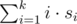

# F. Bear and Bowling 4

**time limit per test:** 2 seconds

**memory limit per test:** 256 megabytes

**input:** standard input

**output:** standard output

Limak is an old brown bear. He often goes bowling with his friends. Today he feels really good and tries to beat his own record!

For rolling a ball one gets a score — an integer (maybe negative) number of points. Score for the *i*-th roll is multiplied by *i* and scores are summed up. So, for *k* rolls with scores *s*~1~, *s*~2~, ..., *s*~*k*~, the total score is



. The total score is 0 if there were no rolls.

Limak made *n* rolls and got score *a*~*i*~ for the *i*-th of them. He wants to maximize his total score and he came up with an interesting idea. He can say that some first rolls were only a warm-up, and that he wasn't focused during the last rolls. More formally, he can cancel any prefix and any suffix of the sequence *a*~1~, *a*~2~, ..., *a*~*n*~. It is allowed to cancel all rolls, or to cancel none of them.

The total score is calculated as if there were only non-canceled rolls. So, the first non-canceled roll has score multiplied by 1, the second one has score multiplied by 2, and so on, till the last non-canceled roll.

What maximum total score can Limak get?

#### Input

The first line contains a single integer *n* (1 ≤ *n* ≤ 2·10^5^) — the total number of rolls made by Limak.

The second line contains *n* integers *a*~1~, *a*~2~, ..., *a*~*n*~ (|*a*~*i*~| ≤ 10^7^) — scores for Limak's rolls.

#### Output

Print the maximum possible total score after cancelling rolls.

#### Examples

#### Input
```
6
5 -1000 1 -3 7 -8
```

#### Output
```
16
```

#### Input
```
5
1000 1000 1001 1000 1000
```

#### Output
```
15003
```

#### Input
```
3
-60 -70 -80
```

#### Output
```
0
```

#### Note

In the first sample test, Limak should cancel the first two rolls, and one last roll. He will be left with rolls 1,  - 3, 7 what gives him the total score 1·1 + 2·( - 3) + 3·7 = 1 - 6 + 21 = 16.
