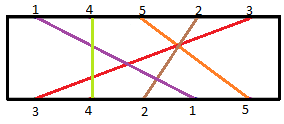

# D. Optical Experiment

**time limit per test:** 5 seconds

**memory limit per test:** 256 megabytes

**input:** stdin

**output:** stdout

Professor Phunsuk Wangdu has performed some experiments on rays. The setup for *n* rays is as follows.

There is a rectangular box having exactly *n* holes on the opposite faces. All rays enter from the holes of the first side and exit from the holes of the other side of the box. Exactly one ray can enter or exit from each hole. The holes are in a straight line.





Professor Wangdu is showing his experiment to his students. He shows that there are cases, when all the rays are intersected by every other ray. A curious student asked the professor: "Sir, there are some groups of rays such that all rays in that group intersect every other ray in that group. Can we determine the number of rays in the largest of such groups?".

Professor Wangdu now is in trouble and knowing your intellect he asks you to help him.

#### Input

The first line contains *n* (1 ≤ *n* ≤ 10^6^), the number of rays. The second line contains *n* distinct integers. The *i*-th integer *x*~*i*~ (1 ≤ *x*~*i*~ ≤ *n*) shows that the *x*~*i*~-th ray enters from the *i*-th hole. Similarly, third line contains *n* distinct integers. The *i*-th integer *y*~*i*~ (1 ≤ *y*~*i*~ ≤ *n*) shows that the *y*~*i*~-th ray exits from the *i*-th hole. All rays are numbered from 1 to *n*.

#### Output

Output contains the only integer which is the number of rays in the largest group of rays all of which intersect each other.

#### Examples

#### Input
```
5
1 4 5 2 3
3 4 2 1 5
```

#### Output
```
3
```

#### Input
```
3
3 1 2
2 3 1
```

#### Output
```
2
```

#### Note

For the first test case, the figure is shown above. The output of the first test case is 3, since the rays number 1, 4 and 3 are the ones which are intersected by each other one i.e. 1 is intersected by 4 and 3, 3 is intersected by 4 and 1, and 4 is intersected by 1 and 3. Hence every ray in this group is intersected by each other one. There does not exist any group containing more than 3 rays satisfying the above-mentioned constraint.
