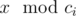
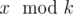
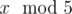
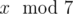

# B. Remainders Game

**time limit per test:** 1 second

**memory limit per test:** 256 megabytes

**input:** standard input

**output:** standard output

Today Pari and Arya are playing a game called Remainders.

Pari chooses two positive integer *x* and *k*, and tells Arya *k* but not *x*. Arya have to find the value


. There are *n* ancient numbers *c*~1~, *c*~2~, ..., *c*~*n*~ and Pari has to tell Arya



 if Arya wants. Given *k* and the ancient values, tell us if Arya has a winning strategy independent of value of *x* or not. Formally, is it true that Arya can understand the value



 for any positive integer *x*?

Note, that


 means the remainder of *x* after dividing it by *y*.

#### Input

The first line of the input contains two integers *n* and *k* (1 ≤ *n*,  *k* ≤ 1 000 000) — the number of ancient integers and value *k* that is chosen by Pari.

The second line contains *n* integers *c*~1~, *c*~2~, ..., *c*~*n*~ (1 ≤ *c*~*i*~ ≤ 1 000 000).

#### Output

Print "Yes" (without quotes) if Arya has a winning strategy independent of value of *x*, or "No" (without quotes) otherwise.

#### Examples

#### Input
```
4 5
2 3 5 12
```

#### Output
```
Yes
```

#### Input
```
2 7
2 3
```

#### Output
```
No
```

#### Note

In the first sample, Arya can understand



 because 5 is one of the ancient numbers.

In the second sample, Arya can't be sure what



 is. For example 1 and 7 have the same remainders after dividing by 2 and 3, but they differ in remainders after dividing by 7.
