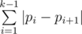
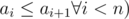

# B. Mike and Shortcuts

**time limit per test:** 3 seconds

**memory limit per test:** 256 megabytes

**input:** standard input

**output:** standard output

Recently, Mike was very busy with studying for exams and contests. Now he is going to chill a bit by doing some sight seeing in the city.

City consists of *n* intersections numbered from 1 to *n*. Mike starts walking from his house located at the intersection number 1 and goes along some sequence of intersections. Walking from intersection number *i* to intersection *j* requires |*i* - *j*| units of energy. The total energy spent by Mike to visit a sequence of intersections *p*~1~ = 1, *p*~2~, ..., *p*~*k*~ is equal to



 units of energy.

Of course, walking would be boring if there were no shortcuts. A shortcut is a special path that allows Mike walking from one intersection to another requiring only 1 unit of energy. There are exactly *n* shortcuts in Mike's city, the *i*^*th*^ of them allows walking from intersection *i* to intersection *a*~*i*~ (*i* ≤ *a*~*i*~ ≤ *a*~*i* + 1~) (but not in the opposite direction), thus there is exactly one shortcut starting at each intersection. Formally, if Mike chooses a sequence *p*~1~ = 1, *p*~2~, ..., *p*~*k*~ then for each 1 ≤ *i* < *k* satisfying *p*~*i* + 1~ = *a*~*p*~*i*~~ and *a*~*p*~*i*~~ ≠ *p*~*i*~ Mike will spend only 1 unit of energy instead of |*p*~*i*~ - *p*~*i* + 1~| walking from the intersection *p*~*i*~ to intersection *p*~*i* + 1~. For example, if Mike chooses a sequence *p*~1~ = 1, *p*~2~ = *a*~*p*~1~~, *p*~3~ = *a*~*p*~2~~, ..., *p*~*k*~ = *a*~*p*~*k* - 1~~, he spends exactly *k* - 1 units of total energy walking around them.

Before going on his adventure, Mike asks you to find the minimum amount of energy required to reach each of the intersections from his home. Formally, for each 1 ≤ *i* ≤ *n* Mike is interested in finding minimum possible total energy of some sequence *p*~1~ = 1, *p*~2~, ..., *p*~*k*~ = *i*.

#### Input

The first line contains an integer *n* (1 ≤ *n* ≤ 200 000) — the number of Mike's city intersection.

The second line contains *n* integers *a*~1~, *a*~2~, ..., *a*~*n*~ (*i* ≤ *a*~*i*~ ≤ *n* ,



, describing shortcuts of Mike's city, allowing to walk from intersection *i* to intersection *a*~*i*~ using only 1 unit of energy. Please note that the shortcuts don't allow walking in opposite directions (from *a*~*i*~ to *i*).

#### Output

In the only line print *n* integers *m*~1~, *m*~2~, ..., *m*~*n*~, where *m*~*i*~ denotes the least amount of total energy required to walk from intersection 1 to intersection *i*.

#### Examples

#### Input
```
3
2 2 3
```

#### Output
```
0 1 2 
```

#### Input
```
5
1 2 3 4 5
```

#### Output
```
0 1 2 3 4 
```

#### Input
```
7
4 4 4 4 7 7 7
```

#### Output
```
0 1 2 1 2 3 3 
```

#### Note

In the first sample case desired sequences are:

1: 1; *m*~1~ = 0;

2: 1, 2; *m*~2~ = 1;

3: 1, 3; *m*~3~ = |3 - 1| = 2.

In the second sample case the sequence for any intersection 1 < *i* is always 1, *i* and *m*~*i*~ = |1 - *i*|.

In the third sample case — consider the following intersection sequences:

1: 1; *m*~1~ = 0;

2: 1, 2; *m*~2~ = |2 - 1| = 1;

3: 1, 4, 3; *m*~3~ = 1 + |4 - 3| = 2;

4: 1, 4; *m*~4~ = 1;

5: 1, 4, 5; *m*~5~ = 1 + |4 - 5| = 2;

6: 1, 4, 6; *m*~6~ = 1 + |4 - 6| = 3;

7: 1, 4, 5, 7; *m*~7~ = 1 + |4 - 5| + 1 = 3.
