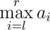
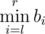
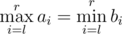

# D. Friends and Subsequences

**time limit per test:** 2 seconds

**memory limit per test:** 512 megabytes

**input:** standard input

**output:** standard output

Mike and !Mike are old childhood rivals, they are opposite in everything they do, except programming. Today they have a problem they cannot solve on their own, but together (with you) — who knows?

Every one of them has an integer sequences *a* and *b* of length *n*. Being given a query of the form of pair of integers (*l*, *r*), Mike can instantly tell the value of



 while !Mike can instantly tell the value of



.

Now suppose a robot (you!) asks them all possible different queries of pairs of integers (*l*, *r*) (1 ≤ *l* ≤ *r* ≤ *n*) (so he will make exactly *n*(*n* + 1) / 2 queries) and counts how many times their answers coincide, thus for how many pairs


 is satisfied.

How many occasions will the robot count?

#### Input

The first line contains only integer *n* (1 ≤ *n* ≤ 200 000).

The second line contains *n* integer numbers *a*~1~, *a*~2~, ..., *a*~*n*~ ( - 10^9^ ≤ *a*~*i*~ ≤ 10^9^) — the sequence *a*.

The third line contains *n* integer numbers *b*~1~, *b*~2~, ..., *b*~*n*~ ( - 10^9^ ≤ *b*~*i*~ ≤ 10^9^) — the sequence *b*.

#### Output

Print the only integer number — the number of occasions the robot will count, thus for how many pairs



 is satisfied.

#### Examples

#### Input
```
6
1 2 3 2 1 4
6 7 1 2 3 2
```

#### Output
```
2
```

#### Input
```
3
3 3 3
1 1 1
```

#### Output
```
0
```

#### Note

The occasions in the first sample case are:

1.*l* = 4,*r* = 4 since *max*{2} = *min*{2}.

2.*l* = 4,*r* = 5 since *max*{2, 1} = *min*{2, 3}.

There are no occasions in the second sample case since Mike will answer 3 to any query pair, but !Mike will always answer 1.
