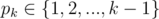

# C3. Brain Network (hard)

**time limit per test:** 2 seconds

**memory limit per test:** 256 megabytes

**input:** standard input

**output:** standard output

Breaking news from zombie neurology! It turns out that – contrary to previous beliefs – every zombie is born with a single brain, and only later it evolves into a complicated brain structure. In fact, whenever a zombie consumes a brain, a new brain appears in its nervous system and gets immediately connected to one of the already existing brains using a single brain connector. Researchers are now interested in monitoring the brain latency of a zombie. Your task is to write a program which, given a history of evolution of a zombie's nervous system, computes its brain latency at every stage.

#### Input

The first line of the input contains one number *n* – the number of brains in the final nervous system (2 ≤ *n* ≤ 200000). In the second line a history of zombie's nervous system evolution is given. For convenience, we number all the brains by 1, 2, ..., *n* in the same order as they appear in the nervous system (the zombie is born with a single brain, number 1, and subsequently brains 2, 3, ..., *n* are added). The second line contains *n* - 1 space-separated numbers *p*~2~, *p*~3~, ..., *p*~*n*~, meaning that after a new brain *k* is added to the system, it gets connected to a parent-brain



.

#### Output

Output *n* - 1 space-separated numbers – the brain latencies after the brain number *k* is added, for *k* = 2, 3, ..., *n*.

#### Example

#### Input
```
6
1
2
2
1
5
```

#### Output
```
1 2 2 3 4 
```
