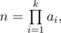
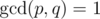

# C. PLEASE

**time limit per test:** 1 second

**memory limit per test:** 256 megabytes

**input:** standard input

**output:** standard output

As we all know Barney's job is "PLEASE" and he has not much to do at work. That's why he started playing "cups and key". In this game there are three identical cups arranged in a line from left to right. Initially key to Barney's heart is under the middle cup.


Then at one turn Barney swaps the cup in the middle with any of other two cups randomly (he choses each with equal probability), so the chosen cup becomes the middle one. Game lasts *n* turns and Barney independently choses a cup to swap with the middle one within each turn, and the key always remains in the cup it was at the start.

After *n*-th turn Barney asks a girl to guess which cup contains the key. The girl points to the middle one but Barney was distracted while making turns and doesn't know if the key is under the middle cup. That's why he asked you to tell him the probability that girl guessed right.

Number *n* of game turns can be extremely large, that's why Barney did not give it to you. Instead he gave you an array *a*~1~, *a*~2~, ..., *a*~*k*~ such that





in other words, *n* is multiplication of all elements of the given array.

Because of precision difficulties, Barney asked you to tell him the answer as an irreducible fraction. In other words you need to find it as a fraction *p* / *q* such that



, where


 is the greatest common divisor. Since *p* and *q* can be extremely large, you only need to find the remainders of dividing each of them by 10^9^ + 7.

Please note that we want


 of *p* and *q* to be 1, not


 of their remainders after dividing by 10^9^ + 7.

#### Input

The first line of input contains a single integer *k* (1 ≤ *k* ≤ 10^5^) — the number of elements in array Barney gave you.

The second line contains *k* integers *a*~1~, *a*~2~, ..., *a*~*k*~ (1 ≤ *a*~*i*~ ≤ 10^18^) — the elements of the array.

#### Output

In the only line of output print a single string *x* / *y* where *x* is the remainder of dividing *p* by 10^9^ + 7 and *y* is the remainder of dividing *q* by 10^9^ + 7.

#### Examples

#### Input
```
1
2
```

#### Output
```
1/2
```

#### Input
```
3
1 1 1
```

#### Output
```
0/1
```
