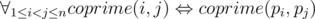

# F. Coprime Permutation

**time limit per test:** 2 seconds

**memory limit per test:** 256 megabytes

**input:** standard input

**output:** standard output

Two positive integers are coprime if and only if they don't have a common divisor greater than 1.

Some bear doesn't want to tell Radewoosh how to solve some algorithmic problem. So, Radewoosh is going to break into that bear's safe with solutions. To pass through the door, he must enter a permutation of numbers 1 through *n*. The door opens if and only if an entered permutation *p*~1~, *p*~2~, ..., *p*~*n*~ satisfies:



In other words, two different elements are coprime if and only if their indices are coprime.

Some elements of a permutation may be already fixed. In how many ways can Radewoosh fill the remaining gaps so that the door will open? Print the answer modulo 10^9^ + 7.

#### Input

The first line of the input contains one integer *n* (2 ≤ *n* ≤ 1 000 000).

The second line contains *n* integers *p*~1~, *p*~2~, ..., *p*~*n*~ (0 ≤ *p*~*i*~ ≤ *n*) where *p*~*i*~ = 0 means a gap to fill, and *p*~*i*~ ≥ 1 means a fixed number.

It's guaranteed that if *i* ≠ *j* and *p*~*i*~, *p*~*j*~ ≥ 1 then *p*~*i*~ ≠ *p*~*j*~.

#### Output

Print the number of ways to fill the gaps modulo 10^9^ + 7 (i.e. modulo 1000000007).

#### Examples

#### Input
```
4
0 0 0 0
```

#### Output
```
4
```

#### Input
```
5
0 0 1 2 0
```

#### Output
```
2
```

#### Input
```
6
0 0 1 2 0 0
```

#### Output
```
0
```

#### Input
```
5
5 3 4 2 1
```

#### Output
```
0
```

#### Note

In the first sample test, none of four element is fixed. There are four permutations satisfying the given conditions: (1,2,3,4), (1,4,3,2), (3,2,1,4), (3,4,1,2).

In the second sample test, there must be *p*~3~ = 1 and *p*~4~ = 2. The two permutations satisfying the conditions are: (3,4,1,2,5), (5,4,1,2,3).
