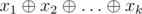
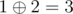
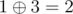

# D. Mishka and Interesting sum

**time limit per test:** 3.5 seconds

**memory limit per test:** 256 megabytes

**input:** standard input

**output:** standard output

Little Mishka enjoys programming. Since her birthday has just passed, her friends decided to present her with array of non-negative integers *a*~1~, *a*~2~, ..., *a*~*n*~ of *n* elements!

Mishka loved the array and she instantly decided to determine its beauty value, but she is too little and can't process large arrays. Right because of that she invited you to visit her and asked you to process *m* queries.

Each query is processed in the following way:

- Two integers *l* and *r* (1 ≤ *l* ≤ *r* ≤ *n*) are specified — bounds of query segment.
- Integers, presented in array segment [*l*,  *r*] (in sequence of integers *a*~*l*~, *a*~*l* + 1~, ..., *a*~*r*~) even number of times, are written down.
- XOR-sum of written down integers is calculated, and this value is the answer for a query. Formally, if integers written down in point 2 are *x*~1~, *x*~2~, ..., *x*~*k*~, then Mishka wants to know the value



, where


 — operator of exclusive bitwise OR.

Since only the little bears know the definition of array beauty, all you are to do is to answer each of queries presented.

#### Input

The first line of the input contains single integer *n* (1 ≤ *n* ≤ 1 000 000) — the number of elements in the array.

The second line of the input contains *n* integers *a*~1~, *a*~2~, ..., *a*~*n*~ (1 ≤ *a*~*i*~ ≤ 10^9^) — array elements.

The third line of the input contains single integer *m* (1 ≤ *m* ≤ 1 000 000) — the number of queries.

Each of the next *m* lines describes corresponding query by a pair of integers *l* and *r* (1 ≤ *l* ≤ *r* ≤ *n*) — the bounds of query segment.

#### Output

Print *m* non-negative integers — the answers for the queries in the order they appear in the input.

#### Examples

#### Input
```
3
3 7 8
1
1 3
```

#### Output
```
0
```

#### Input
```
7
1 2 1 3 3 2 3
5
4 7
4 5
1 3
1 7
1 5
```

#### Output
```
0
3
1
3
2
```

#### Note

In the second sample:

There is no integers in the segment of the first query, presented even number of times in the segment — the answer is 0.

In the second query there is only integer 3 is presented even number of times — the answer is 3.

In the third query only integer 1 is written down — the answer is 1.

In the fourth query all array elements are considered. Only 1 and 2 are presented there even number of times. The answer is



.

In the fifth query 1 and 3 are written down. The answer is



.
