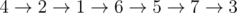

# B. Ant Man

**time limit per test:** 4 seconds

**memory limit per test:** 256 megabytes

**input:** standard input

**output:** standard output

Scott Lang is at war with Darren Cross. There are *n* chairs in a hall where they are, numbered with 1, 2, ..., *n* from left to right. The *i*-th chair is located at coordinate *x*~*i*~. Scott is on chair number *s* and Cross is on chair number *e*. Scott can jump to all other chairs (not only neighboring chairs). He wants to start at his position (chair number *s*), visit each chair exactly once and end up on chair number *e* with Cross.

As we all know, Scott can shrink or grow big (grow big only to his normal size), so at any moment of time he can be either small or large (normal). The thing is, he can only shrink or grow big while being on a chair (not in the air while jumping to another chair). Jumping takes time, but shrinking and growing big takes no time. Jumping from chair number *i* to chair number *j* takes |*x*~*i*~ - *x*~*j*~| seconds. Also, jumping off a chair and landing on a chair takes extra amount of time.

If Scott wants to jump to a chair on his left, he can only be small, and if he wants to jump to a chair on his right he should be large.

Jumping off the *i*-th chair takes:

- *c*~*i*~ extra seconds if he's small.
- *d*~*i*~ extra seconds otherwise (he's large).

Also, landing on *i*-th chair takes:

- *b*~*i*~ extra seconds if he's small.
- *a*~*i*~ extra seconds otherwise (he's large).

In simpler words, jumping from *i*-th chair to *j*-th chair takes exactly:

- |*x*~*i*~ - *x*~*j*~| + *c*~*i*~ + *b*~*j*~ seconds if *j* < *i*.
- |*x*~*i*~ - *x*~*j*~| + *d*~*i*~ + *a*~*j*~ seconds otherwise (*j* > *i*).

Given values of *x*, *a*, *b*, *c*, *d* find the minimum time Scott can get to Cross, assuming he wants to visit each chair exactly once.

#### Input

The first line of the input contains three integers *n*, *s* and *e* (2 ≤ *n* ≤ 5000, 1 ≤ *s*, *e* ≤ *n*, *s* ≠ *e*) — the total number of chairs, starting and ending positions of Scott.

The second line contains *n* integers *x*~1~, *x*~2~, ..., *x*~*n*~ (1 ≤ *x*~1~ < *x*~2~ < ... < *x*~*n*~ ≤ 10^9^).

The third line contains *n* integers *a*~1~, *a*~2~, ..., *a*~*n*~ (1 ≤ *a*~1~, *a*~2~, ..., *a*~*n*~ ≤ 10^9^).

The fourth line contains *n* integers *b*~1~, *b*~2~, ..., *b*~*n*~ (1 ≤ *b*~1~, *b*~2~, ..., *b*~*n*~ ≤ 10^9^).

The fifth line contains *n* integers *c*~1~, *c*~2~, ..., *c*~*n*~ (1 ≤ *c*~1~, *c*~2~, ..., *c*~*n*~ ≤ 10^9^).

The sixth line contains *n* integers *d*~1~, *d*~2~, ..., *d*~*n*~ (1 ≤ *d*~1~, *d*~2~, ..., *d*~*n*~ ≤ 10^9^).

#### Output

Print the minimum amount of time Scott needs to get to the Cross while visiting each chair exactly once.

#### Example

#### Input
```
7 4 3
8 11 12 16 17 18 20
17 16 20 2 20 5 13
17 8 8 16 12 15 13
12 4 16 4 15 7 6
8 14 2 11 17 12 8
```

#### Output
```
139
```

#### Note

In the sample testcase, an optimal solution would be



. Spent time would be 17 + 24 + 23 + 20 + 33 + 22 = 139.
