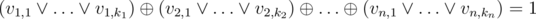
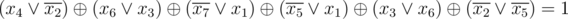
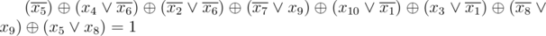
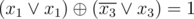

# C. Black Widow

**time limit per test:** 2 seconds

**memory limit per test:** 256 megabytes

**input:** standard input

**output:** standard output

Natalia Romanova is trying to test something on the new gun S.H.I.E.L.D gave her. In order to determine the result of the test, she needs to find the number of answers to a certain equation. The equation is of form:



Where


 represents logical OR and


 represents logical exclusive OR (XOR), and *v*~*i*, *j*~ are some boolean variables or their negations. Natalia calls the left side of the equation a XNF formula. Each statement in brackets is called a clause, and *v*~*i*, *j*~ are called literals.

In the equation Natalia has, the left side is actually a 2-XNF-2 containing variables *x*~1~, *x*~2~, ..., *x*~*m*~ and their negations. An XNF formula is 2-XNF-2 if:

- For each 1 ≤ *i* ≤ *n*, *k*~*i*~ ≤ 2, i.e. the size of each clause doesn't exceed two.
- Each variable occurs in the formula at most two times (with negation and without negation in total). Please note that it's possible that a variable occurs twice but its negation doesn't occur in any clause (or vice versa).

Natalia is given a formula of *m* variables, consisting of *n* clauses. Please, make sure to check the samples in order to properly understand how the formula looks like.

Natalia is more into fight than theory, so she asked you to tell her the number of answers to this equation. More precisely, you need to find the number of ways to set *x*~1~, ..., *x*~*m*~ with *true* and *false* (out of total of 2^*m*^ ways) so that the equation is satisfied. Since this number can be extremely large, you need to print the answer modulo 10^9^ + 7.

Please, note that some variable may appear twice in one clause, or not appear in the equation at all (but still, setting it to *false* or *true* gives different ways to set variables).

#### Input

The first line of input contains two integers *n* and *m* (1 ≤ *n*, *m* ≤ 100 000) — the number of clauses and the number of variables respectively.

The next *n* lines contain the formula. The *i*-th of them starts with an integer *k*~*i*~ — the number of literals in the *i*-th clause. It is followed by *k*~*i*~ non-zero integers *a*~*i*, 1~, ..., *a*~*i*, *k*~*i*~~. If *a*~*i*, *j*~ > 0 then *v*~*i*, *j*~ is *x*~*a*~*i*, *j*~~ otherwise it's negation of *x*~ - *a*~*i*, *j*~~ (1 ≤ *k*~*i*~ ≤ 2,  - *m* ≤ *a*~*i*, *j*~ ≤ *m*, *a*~*i*, *j*~ ≠ 0).

#### Output

Print the answer modulo 1 000 000 007 (10^9^ + 7) in one line.

#### Examples

#### Input
```
6 7
2 4 -2
2 6 3
2 -7 1
2 -5 1
2 3 6
2 -2 -5
```

#### Output
```
48
```

#### Input
```
8 10
1 -5
2 4 -6
2 -2 -6
2 -7 9
2 10 -1
2 3 -1
2 -8 9
2 5 8
```

#### Output
```
544
```

#### Input
```
2 3
2 1 1
2 -3 3
```

#### Output
```
4
```

#### Note

The equation in the first sample is:



The equation in the second sample is:



The equation in the third sample is:


