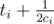

# E. Iron Man

**time limit per test:** 5 seconds

**memory limit per test:** 256 megabytes

**input:** standard input

**output:** standard output

Tony Stark is playing a game with his suits (they have auto-pilot now). He lives in Malibu. Malibu has *n* junctions numbered from 1 to *n*, connected with *n* - 1 roads. One can get from a junction to any other junction using these roads (graph of Malibu forms a tree).

Tony has *m* suits. There's a special plan for each suit. The *i*-th suit will appear at the moment of time *t*~*i*~ in the junction *v*~*i*~, and will move to junction *u*~*i*~ using the shortest path between *v*~*i*~ and *u*~*i*~ with the speed *c*~*i*~ roads per second (passing a junctions takes no time), and vanishing immediately when arriving at *u*~*i*~ (if it reaches *u*~*i*~ in time *q*, it's available there at moment *q*, but not in further moments). Also, suits move continuously (for example if *v*~*i*~ ≠ *u*~*i*~, at time



 it's in the middle of a road. Please note that if *v*~*i*~ = *u*~*i*~ it means the suit will be at junction number *v*~*i*~ only at moment *t*~*i*~ and then it vanishes.

An explosion happens if at any moment of time two suits share the same exact location (it may be in a junction or somewhere on a road; while appearing, vanishing or moving).

Your task is to tell Tony the moment of the the first explosion (if there will be any).

#### Input

The first line of the input contains two integers *n* and *m* (1 ≤ *n*, *m* ≤ 100 000) — the number of junctions and the number of suits respectively.

The next *n* - 1 lines contain the roads descriptions. Each line contains two integers *a*~*i*~ and *b*~*i*~ — endpoints of the *i*-th road (1 ≤ *a*~*i*~, *b*~*i*~ ≤ *n*, *a*~*i*~ ≠ *b*~*i*~).

The next *m* lines contain the suit descriptions. The *i*-th of them contains four integers *t*~*i*~, *c*~*i*~, *v*~*i*~ and *u*~*i*~ (0 ≤ *t*~*i*~ ≤ 10 000, 1 ≤ *c*~*i*~ ≤ 10 000, 1 ≤ *v*~*i*~, *u*~*i*~ ≤ *n*), meaning the *i*-th suit will appear at moment of time *t*~*i*~ at the junction *v*~*i*~ and will move to the junction *u*~*i*~ with a speed *c*~*i*~ roads per second.

#### Output

If there would be no explosions at all, print -1 in the first and only line of output.

Otherwise print the moment of the first explosion.

Your answer will be considered correct if its relative or absolute error doesn't exceed 10^ - 6^.

#### Examples

#### Input
```
6 4
2 5
6 5
3 6
4 6
4 1
27 6 1 3
9 5 1 6
27 4 3 4
11 29 2 6
```

#### Output
```
27.3
```

#### Input
```
6 4
3 1
4 5
6 4
6 1
2 6
16 4 4 5
13 20 6 2
3 16 4 5
28 5 3 5
```

#### Output
```
-1
```
