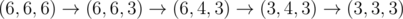
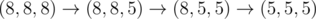
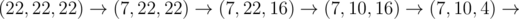
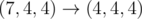

# C. Memory and De-Evolution

**time limit per test:** 2 seconds

**memory limit per test:** 256 megabytes

**input:** standard input

**output:** standard output

Memory is now interested in the de-evolution of objects, specifically triangles. He starts with an equilateral triangle of side length *x*, and he wishes to perform operations to obtain an equilateral triangle of side length *y*.

In a single second, he can modify the length of a single side of the current triangle such that it remains a non-degenerate triangle (triangle of positive area). At any moment of time, the length of each side should be integer.

What is the minimum number of seconds required for Memory to obtain the equilateral triangle of side length *y*?

#### Input

The first and only line contains two integers *x* and *y* (3 ≤ *y* < *x* ≤ 100 000) — the starting and ending equilateral triangle side lengths respectively.

#### Output

Print a single integer — the minimum number of seconds required for Memory to obtain the equilateral triangle of side length *y* if he starts with the equilateral triangle of side length *x*.

#### Examples

#### Input
```
6 3
```

#### Output
```
4
```

#### Input
```
8 5
```

#### Output
```
3
```

#### Input
```
22 4
```

#### Output
```
6
```

#### Note

In the first sample test, Memory starts with an equilateral triangle of side length 6 and wants one of side length 3. Denote a triangle with sides *a*, *b*, and *c* as (*a*, *b*, *c*). Then, Memory can do



.

In the second sample test, Memory can do



.

In the third sample test, Memory can do:





.
