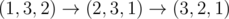

# E. Complete the Permutations

**time limit per test:** 5 seconds

**memory limit per test:** 256 megabytes

**input:** standard input

**output:** standard output

ZS the Coder is given two permutations *p* and *q* of {1, 2, ..., *n*}, but some of their elements are replaced with 0. The distance between two permutations *p* and *q* is defined as the minimum number of moves required to turn *p* into *q*. A move consists of swapping exactly 2 elements of *p*.

ZS the Coder wants to determine the number of ways to replace the zeros with positive integers from the set {1, 2, ..., *n*} such that *p* and *q* are permutations of {1, 2, ..., *n*} and the distance between *p* and *q* is exactly *k*.

ZS the Coder wants to find the answer for all 0 ≤ *k* ≤ *n* - 1. Can you help him?

#### Input

The first line of the input contains a single integer *n* (1 ≤ *n* ≤ 250) — the number of elements in the permutations.

The second line contains *n* integers, *p*~1~, *p*~2~, ..., *p*~*n*~ (0 ≤ *p*~*i*~ ≤ *n*) — the permutation *p*. It is guaranteed that there is at least one way to replace zeros such that *p* is a permutation of {1, 2, ..., *n*}.

The third line contains *n* integers, *q*~1~, *q*~2~, ..., *q*~*n*~ (0 ≤ *q*~*i*~ ≤ *n*) — the permutation *q*. It is guaranteed that there is at least one way to replace zeros such that *q* is a permutation of {1, 2, ..., *n*}.

#### Output

Print *n* integers, *i*-th of them should denote the answer for *k* = *i* - 1. Since the answer may be quite large, and ZS the Coder loves weird primes, print them modulo 998244353 = 2^23^·7·17 + 1, which is a prime.

#### Examples

#### Input
```
3
1 0 0
0 2 0
```

#### Output
```
1 2 1 
```

#### Input
```
4
1 0 0 3
0 0 0 4
```

#### Output
```
0 2 6 4 
```

#### Input
```
6
1 3 2 5 4 6
6 4 5 1 0 0
```

#### Output
```
0 0 0 0 1 1 
```

#### Input
```
4
1 2 3 4
2 3 4 1
```

#### Output
```
0 0 0 1 
```

#### Note

In the first sample case, there is the only way to replace zeros so that it takes 0 swaps to convert *p* into *q*, namely *p* = (1, 2, 3), *q* = (1, 2, 3).

There are two ways to replace zeros so that it takes 1 swap to turn *p* into *q*. One of these ways is *p* = (1, 2, 3), *q* = (3, 2, 1), then swapping 1 and 3 from *p* transform it into *q*. The other way is *p* = (1, 3, 2), *q* = (1, 2, 3). Swapping 2 and 3 works in this case.

Finally, there is one way to replace zeros so that it takes 2 swaps to turn *p* into *q*, namely *p* = (1, 3, 2), *q* = (3, 2, 1). Then, we can transform *p* into *q* like following:



.
