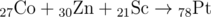
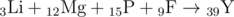

# E. Nuclear Fusion

**time limit per test:** 1.5 seconds

**memory limit per test:** 256 megabytes

**input:** stdin

**output:** stdout

There is the following puzzle popular among nuclear physicists.

A reactor contains a set of *n* atoms of some chemical elements. We shall understand the phrase "atomic number" as the number of this atom's element in the periodic table of the chemical elements.

You are allowed to take any two different atoms and fuse a new one from them. That results in a new atom, whose number is equal to the sum of the numbers of original atoms. The fusion operation can be performed several times.

The aim is getting a new pregiven set of *k* atoms.

The puzzle's difficulty is that it is only allowed to fuse two atoms into one, it is not allowed to split an atom into several atoms. You are suggested to try to solve the puzzle.

#### Input

The first line contains two integers *n* and *k* (1 ≤ *k* ≤ *n* ≤ 17). The second line contains space-separated symbols of elements of *n* atoms, which are available from the start. The third line contains space-separated symbols of elements of *k* atoms which need to be the result of the fusion. The symbols of the elements coincide with the symbols from the periodic table of the chemical elements. The atomic numbers do not exceed 100 (elements possessing larger numbers are highly unstable). Some atoms can have identical numbers (that is, there can be several atoms of the same element). The sum of numbers of initial atoms is equal to the sum of numbers of the atoms that need to be synthesized.

#### Output

If it is impossible to synthesize the required atoms, print "NO" without the quotes. Otherwise, print on the first line «YES», and on the next *k* lines print the way of synthesizing each of *k* atoms as equations. Each equation has the following form: "*x*~1~+*x*~2~+...+*x*~*t*~->*y*~*i*~", where *x*~*j*~ is the symbol of the element of some atom from the original set, and *y*~*i*~ is the symbol of the element of some atom from the resulting set. Each atom from the input data should occur in the output data exactly one time. The order of summands in the equations, as well as the output order does not matter. If there are several solutions, print any of them. For a better understanding of the output format, see the samples.

#### Examples

#### Input
```
10 3
Mn Co Li Mg C P F Zn Sc K
Sn Pt Y
```

#### Output
```
YES
Mn+C+K->Sn
Co+Zn+Sc->Pt
Li+Mg+P+F->Y
```

#### Input
```
2 1
H H
He
```

#### Output
```
YES
H+H->He
```

#### Input
```
2 2
Bk Fm
Cf Es
```

#### Output
```
NO
```

#### Note

The reactions from the first example possess the following form (the atomic number is written below and to the left of the element):






To find a periodic table of the chemical elements, you may use your favorite search engine.

The pretest set contains each of the first 100 elements of the periodic table at least once. You can use that information to check for misprints.
