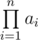
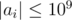
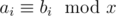

# D. Maxim and Array

**time limit per test:** 2 seconds

**memory limit per test:** 256 megabytes

**input:** standard input

**output:** standard output

Recently Maxim has found an array of *n* integers, needed by no one. He immediately come up with idea of changing it: he invented positive integer *x* and decided to add or subtract it from arbitrary array elements. Formally, by applying single operation Maxim chooses integer *i* (1 ≤ *i* ≤ *n*) and replaces the *i*-th element of array *a*~*i*~ either with *a*~*i*~ + *x* or with *a*~*i*~ - *x*. Please note that the operation may be applied more than once to the same position.

Maxim is a curious minimalis, thus he wants to know what is the minimum value that the product of all array elements (i.e.



) can reach, if Maxim would apply no more than *k* operations to it. Please help him in that.

#### Input

The first line of the input contains three integers *n*, *k* and *x* (1 ≤ *n*, *k* ≤ 200 000, 1 ≤ *x* ≤ 10^9^) — the number of elements in the array, the maximum number of operations and the number invented by Maxim, respectively.

The second line contains *n* integers *a*~1~, *a*~2~, ..., *a*~*n*~ (



) — the elements of the array found by Maxim.

#### Output

Print *n* integers *b*~1~, *b*~2~, ..., *b*~*n*~ in the only line — the array elements after applying no more than *k* operations to the array. In particular,



 should stay true for every 1 ≤ *i* ≤ *n*, but the product of all array elements should be minimum possible.

If there are multiple answers, print any of them.

#### Examples

#### Input
```
5 3 1
5 4 3 5 2
```

#### Output
```
5 4 3 5 -1 
```

#### Input
```
5 3 1
5 4 3 5 5
```

#### Output
```
5 4 0 5 5 
```

#### Input
```
5 3 1
5 4 4 5 5
```

#### Output
```
5 1 4 5 5 
```

#### Input
```
3 2 7
5 4 2
```

#### Output
```
5 11 -5 
```
