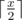
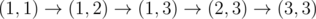
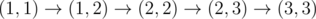
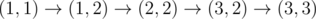
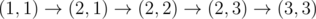
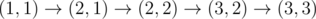
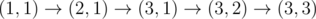
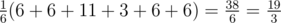

# E. Research Rover

**time limit per test:** 2.5 seconds

**memory limit per test:** 256 megabytes

**input:** standard input

**output:** standard output

Unfortunately, the formal description of the task turned out to be too long, so here is the legend.

Research rover finally reached the surface of Mars and is ready to complete its mission. Unfortunately, due to the mistake in the navigation system design, the rover is located in the wrong place.

The rover will operate on the grid consisting of *n* rows and *m* columns. We will define as (*r*, *c*) the cell located in the row *r* and column *c*. From each cell the rover is able to move to any cell that share a side with the current one.

The rover is currently located at cell (1, 1) and has to move to the cell (*n*, *m*). It will randomly follow some shortest path between these two cells. Each possible way is chosen equiprobably.

The cargo section of the rover contains the battery required to conduct the research. Initially, the battery charge is equal to *s* units of energy.

Some of the cells contain anomaly. Each time the rover gets to the cell with anomaly, the battery looses half of its charge rounded down. Formally, if the charge was equal to *x* before the rover gets to the cell with anomaly, the charge will change to



.

While the rover picks a random shortest path to proceed, compute the expected value of the battery charge after it reaches cell (*n*, *m*). If the cells (1, 1) and (*n*, *m*) contain anomaly, they also affect the charge of the battery.

#### Input

The first line of the input contains four integers *n*, *m*, *k* and *s* (1 ≤ *n*, *m* ≤ 100 000, 0 ≤ *k* ≤ 2000, 1 ≤ *s* ≤ 1 000 000) — the number of rows and columns of the field, the number of cells with anomaly and the initial charge of the battery respectively.

The follow *k* lines containing two integers *r*~*i*~ and *c*~*i*~ (1 ≤ *r*~*i*~ ≤ *n*, 1 ≤ *c*~*i*~ ≤ *m*) — coordinates of the cells, containing anomaly. It's guaranteed that each cell appears in this list no more than once.

#### Output

The answer can always be represented as an irreducible fraction


. Print the only integer *P*·*Q*^ - 1^ modulo 10^9^ + 7.

#### Examples

#### Input
```
3 3 2 11
2 1
2 3
```

#### Output
```
333333342
```

#### Input
```
4 5 3 17
1 2
3 3
4 1
```

#### Output
```
514285727
```

#### Input
```
1 6 2 15
1 1
1 5
```

#### Output
```
4
```

#### Note

In the first sample, the rover picks one of the following six routes:

-



, after passing cell (2, 3) charge is equal to 6.
-



, after passing cell (2, 3) charge is equal to 6.
-



, charge remains unchanged and equals 11.
-



, after passing cells (2, 1) and (2, 3) charge equals 6 and then 3.
-



, after passing cell (2, 1) charge is equal to 6.
-



, after passing cell (2, 1) charge is equal to 6.

Expected value of the battery charge is calculated by the following formula:



.

Thus *P* = 19, and *Q* = 3.

3^ - 1^ modulo 10^9^ + 7 equals 333333336.

19·333333336 = 333333342 (*mod* 10^9^ + 7)
