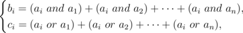

# F. Anton and School

**time limit per test:** 2 seconds

**memory limit per test:** 256 megabytes

**input:** standard input

**output:** standard output

Anton goes to school, his favorite lessons are arraystudying. He usually solves all the tasks pretty fast, but this time the teacher gave him a complicated one: given two arrays *b* and *c* of length *n*, find array *a*, such that:



where *a* *and* *b* means bitwise AND, while *a* *or* *b* means bitwise OR.

Usually Anton is good in arraystudying, but this problem is too hard, so Anton asks you to help.

#### Input

The first line of the input contains a single integers *n* (1 ≤ *n* ≤ 200 000) — the size of arrays *b* and *c*.

The second line contains *n* integers *b*~*i*~ (0 ≤ *b*~*i*~ ≤ 10^9^) — elements of the array *b*.

Third line contains *n* integers *c*~*i*~ (0 ≤ *c*~*i*~ ≤ 10^9^) — elements of the array *c*.

#### Output

If there is no solution, print  - 1.

Otherwise, the only line of the output should contain *n* non-negative integers *a*~*i*~ — elements of the array *a*. If there are multiple possible solutions, you may print any of them.

#### Examples

#### Input
```
4
6 8 4 4
16 22 10 10
```

#### Output
```
3 5 1 1 
```

#### Input
```
5
8 25 14 7 16
19 6 9 4 25
```

#### Output
```
-1
```
