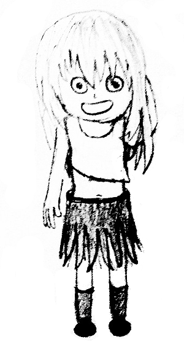

# D. Arpa’s letter-marked tree and Mehrdad’s Dokhtar-kosh paths

**time limit per test:** 3 seconds

**memory limit per test:** 256 megabytes

**input:** standard input

**output:** standard output

Just in case somebody missed it: we have wonderful girls in Arpa’s land.

Arpa has a rooted tree (connected acyclic graph) consisting of *n* vertices. The vertices are numbered 1 through *n*, the vertex 1 is the root. There is a letter written on each edge of this tree. Mehrdad is a fan of Dokhtar-kosh things. He call a string Dokhtar-kosh, if we can shuffle the characters in string such that it becomes palindrome.





He asks Arpa, for each vertex *v*, what is the length of the longest simple path in subtree of *v* that form a Dokhtar-kosh string.

#### Input

The first line contains integer *n* (1  ≤  *n*  ≤  5·10^5^) — the number of vertices in the tree.

(*n*  -  1) lines follow, the *i*-th of them contain an integer *p*~*i* + 1~ and a letter *c*~*i* + 1~ (1  ≤  *p*~*i* + 1~  ≤  *i*, *c*~*i* + 1~ is lowercase English letter, between a and v, inclusively), that mean that there is an edge between nodes *p*~*i* + 1~ and *i* + 1 and there is a letter *c*~*i* + 1~ written on this edge.

#### Output

Print *n* integers. The *i*-th of them should be the length of the longest simple path in subtree of the *i*-th vertex that form a Dokhtar-kosh string.

#### Examples

#### Input
```
4
1 s
2 a
3 s
```

#### Output
```
3 1 1 0 
```

#### Input
```
5
1 a
2 h
1 a
4 h
```

#### Output
```
4 1 0 1 0 
```
