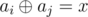
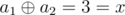
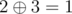
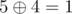

# B. Arpa’s obvious problem and Mehrdad’s terrible solution

**time limit per test:** 1 second

**memory limit per test:** 256 megabytes

**input:** standard input

**output:** standard output

There are some beautiful girls in Arpa’s land as mentioned before.

Once Arpa came up with an obvious problem:

Given an array and a number *x*, count the number of pairs of indices *i*, *j* (1 ≤ *i* < *j* ≤ *n*) such that



, where


 is bitwise xor operation (see notes for explanation).


Immediately, Mehrdad discovered a terrible solution that nobody trusted. Now Arpa needs your help to implement the solution to that problem.

#### Input

First line contains two integers *n* and *x* (1 ≤ *n* ≤ 10^5^, 0 ≤ *x* ≤ 10^5^) — the number of elements in the array and the integer *x*.

Second line contains *n* integers *a*~1~, *a*~2~, ..., *a*~*n*~ (1 ≤ *a*~*i*~ ≤ 10^5^) — the elements of the array.

#### Output

Print a single integer: the answer to the problem.

#### Examples

#### Input
```
2 3
1 2
```

#### Output
```
1
```

#### Input
```
6 1
5 1 2 3 4 1
```

#### Output
```
2
```

#### Note

In the first sample there is only one pair of *i* = 1 and *j* = 2.



 so the answer is 1.

In the second sample the only two pairs are *i* = 3, *j* = 4 (since



) and *i* = 1, *j* = 5 (since



).

A bitwise xor takes two bit integers of equal length and performs the logical xor operation on each pair of corresponding bits. The result in each position is 1 if only the first bit is 1 or only the second bit is 1, but will be 0 if both are 0 or both are 1. You can read more about bitwise xor operation here: [https://en.wikipedia.org/wiki/Bitwise_operation#XOR](<https://en.wikipedia.org/wiki/Bitwise_operation#XOR>).
