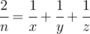

# C. Vladik and fractions

**time limit per test:** 1 second

**memory limit per test:** 256 megabytes

**input:** standard input

**output:** standard output

Vladik and Chloe decided to determine who of them is better at math. Vladik claimed that for any positive integer *n* he can represent fraction


 as a sum of three distinct positive fractions in form


.

Help Vladik with that, i.e for a given *n* find three distinct positive integers *x*, *y* and *z* such that



. Because Chloe can't check Vladik's answer if the numbers are large, he asks you to print numbers not exceeding 10^9^.

If there is no such answer, print -1.

#### Input

The single line contains single integer *n* (1 ≤ *n* ≤ 10^4^).

#### Output

If the answer exists, print 3 distinct numbers *x*, *y* and *z* (1 ≤ *x*, *y*, *z* ≤ 10^9^, *x* ≠ *y*, *x* ≠ *z*, *y* ≠ *z*). Otherwise print -1.

If there are multiple answers, print any of them.

#### Examples

#### Input
```
3
```

#### Output
```
2 7 42
```

#### Input
```
7
```

#### Output
```
7 8 56
```
