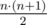
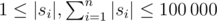

# E. Hongcow Masters the Cyclic Shift

**time limit per test:** 5 seconds

**memory limit per test:** 256 megabytes

**input:** standard input

**output:** standard output

Hongcow's teacher heard that Hongcow had learned about the cyclic shift, and decided to set the following problem for him.

You are given a list of *n* strings *s*~1~, *s*~2~, ..., *s*~*n*~ contained in the list *A*.

A list *X* of strings is called stable if the following condition holds.

First, a message is defined as a concatenation of some elements of the list *X*. You can use an arbitrary element as many times as you want, and you may concatenate these elements in any arbitrary order. Let *S*~*X*~ denote the set of of all messages you can construct from the list. Of course, this set has infinite size if your list is nonempty.

Call a single message good if the following conditions hold:

- Suppose the message is the concatenation of *k* strings *w*~1~, *w*~2~, ..., *w*~*k*~, where each *w*~*i*~ is an element of *X*.
- Consider the |*w*~1~| + |*w*~2~| + ... + |*w*~*k*~| cyclic shifts of the string. Let *m* be the number of these cyclic shifts of the string that are elements of *S*~*X*~.
- A message is good if and only if *m* is exactly equal to *k*.

The list *X* is called stable if and only if every element of *S*~*X*~ is good.

Let *f*(*L*) be 1 if *L* is a stable list, and 0 otherwise.

Find the sum of *f*(*L*) where *L* is a nonempty contiguous sublist of *A* (there are



 contiguous sublists in total).

#### Input

The first line of input will contain a single integer *n* (1 ≤ *n* ≤ 30), denoting the number of strings in the list.

The next *n* lines will each contain a string *s*~*i*~ (



).

#### Output

Print a single integer, the number of nonempty contiguous sublists that are stable.

#### Examples

#### Input
```
4
a
ab
b
bba
```

#### Output
```
7
```

#### Input
```
5
hh
ee
ll
ll
oo
```

#### Output
```
0
```

#### Input
```
6
aab
ab
bba
b
ab
c
```

#### Output
```
13
```

#### Note

For the first sample, there are 10 sublists to consider. Sublists ["a", "ab", "b"], ["ab", "b", "bba"], and ["a", "ab", "b", "bba"] are not stable. The other seven sublists are stable.

For example, *X* = ["a", "ab", "b"] is not stable, since the message "ab" + "ab" = "abab" has four cyclic shifts ["abab", "baba", "abab", "baba"], which are all elements of *S*~*X*~.
