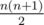
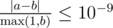

# E. Inversions After Shuffle

**time limit per test:** 1 second

**memory limit per test:** 256 megabytes

**input:** standard input

**output:** standard output

You are given a permutation of integers from 1 to *n*. Exactly once you apply the following operation to this permutation: pick a random segment and shuffle its elements. Formally:

- Pick a random segment (continuous subsequence) from *l* to *r*. All



 segments are equiprobable.
- Let *k* = *r* - *l* + 1, i.e. the length of the chosen segment. Pick a random permutation of integers from 1 to *k*, *p*~1~, *p*~2~, ..., *p*~*k*~. All *k*! permutation are equiprobable.
- This permutation is applied to elements of the chosen segment, i.e. permutation *a*~1~, *a*~2~, ..., *a*~*l* - 1~, *a*~*l*~, *a*~*l* + 1~, ..., *a*~*r* - 1~, *a*~*r*~, *a*~*r* + 1~, ..., *a*~*n*~ is transformed to *a*~1~, *a*~2~, ..., *a*~*l* - 1~, *a*~*l* - 1 + *p*~1~~, *a*~*l* - 1 + *p*~2~~, ..., *a*~*l* - 1 + *p*~*k* - 1~~, *a*~*l* - 1 + *p*~*k*~~, *a*~*r* + 1~, ..., *a*~*n*~.

Inversion if a pair of elements (not necessary neighbouring) with the wrong relative order. In other words, the number of inversion is equal to the number of pairs (*i*, *j*) such that *i* < *j* and *a*~*i*~ > *a*~*j*~. Find the expected number of inversions after we apply exactly one operation mentioned above.

#### Input

The first line contains a single integer *n* (1 ≤ *n* ≤ 100 000) — the length of the permutation.

The second line contains *n* distinct integers from 1 to *n* — elements of the permutation.

#### Output

Print one real value — the expected number of inversions. Your answer will be considered correct if its absolute or relative error does not exceed 10^ - 9^.

Namely: let's assume that your answer is *a*, and the answer of the jury is *b*. The checker program will consider your answer correct, if



.

#### Example

#### Input
```
3
2 3 1
```

#### Output
```
1.916666666666666666666666666667
```
