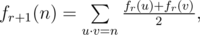

# E. Bash Plays with Functions

**time limit per test:** 3 seconds

**memory limit per test:** 256 megabytes

**input:** standard input

**output:** standard output

Bash got tired on his journey to become the greatest Pokemon master. So he decides to take a break and play with functions.

Bash defines a function *f*~0~(*n*), which denotes the number of ways of factoring *n* into two factors *p* and *q* such that *gcd*(*p*, *q*) = 1. In other words, *f*~0~(*n*) is the number of ordered pairs of positive integers (*p*, *q*) such that *p*·*q* = *n* and *gcd*(*p*, *q*) = 1.

But Bash felt that it was too easy to calculate this function. So he defined a series of functions, where *f*~*r* + 1~ is defined as:



Where (*u*, *v*) is any ordered pair of positive integers, they need not to be co-prime.

Now Bash wants to know the value of *f*~*r*~(*n*) for different *r* and *n*. Since the value could be huge, he would like to know the value modulo 10^9^ + 7. Help him!

#### Input

The first line contains an integer *q* (1 ≤ *q* ≤ 10^6^) — the number of values Bash wants to know.

Each of the next *q* lines contain two integers *r* and *n* (0 ≤ *r* ≤ 10^6^, 1 ≤ *n* ≤ 10^6^), which denote Bash wants to know the value *f*~*r*~(*n*).

#### Output

Print *q* integers. For each pair of *r* and *n* given, print *f*~*r*~(*n*) modulo 10^9^ + 7 on a separate line.

#### Example

#### Input
```
5
0 30
1 25
3 65
2 5
4 48
```

#### Output
```
8
5
25
4
630
```
