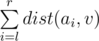
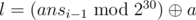
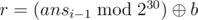
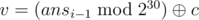
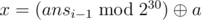

# G. Can Bash Save the Day?

**time limit per test:** 5 seconds

**memory limit per test:** 768 megabytes

**input:** standard input

**output:** standard output

Whoa! You did a great job helping Team Rocket who managed to capture all the Pokemons sent by Bash. Meowth, part of Team Rocket, having already mastered the human language, now wants to become a master in programming as well. He agrees to free the Pokemons if Bash can answer his questions.

Initially, Meowth gives Bash a weighted tree containing *n* nodes and a sequence *a*~1~, *a*~2~..., *a*~*n*~ which is a permutation of 1, 2, ..., *n*. Now, Mewoth makes *q* queries of one of the following forms:

- 1 l r v: meaning Bash should report



, where *dist*(*a*, *b*) is the length of the shortest path from node *a* to node *b* in the given tree.
- 2 x: meaning Bash should swap *a*~*x*~ and *a*~*x* + 1~ in the given sequence. This new sequence is used for later queries.

Help Bash to answer the questions!

#### Input

The first line contains two integers *n* and *q* (1 ≤ *n* ≤ 2·10^5^, 1 ≤ *q* ≤ 2·10^5^) — the number of nodes in the tree and the number of queries, respectively.

The next line contains *n* space-separated integers — the sequence *a*~1~, *a*~2~, ..., *a*~*n*~ which is a permutation of 1, 2, ..., *n*.

Each of the next *n* - 1 lines contain three space-separated integers *u*, *v*, and *w* denoting that there exists an undirected edge between node *u* and node *v* of weight *w*, (1 ≤ *u*, *v* ≤ *n*, *u* ≠ *v*, 1 ≤ *w* ≤ 10^6^). It is guaranteed that the given graph is a tree.

Each query consists of two lines. First line contains single integer *t*, indicating the type of the query. Next line contains the description of the query:

- t = 1: Second line contains three integers *a*, *b* and *c* (1 ≤ *a*, *b*, *c* < 2^30^) using which *l*, *r* and *v* can be generated using the formula given below:

 -



,
 -



,
 -



.

- t = 2: Second line contains single integer *a* (1 ≤ *a* < 2^30^) using which *x* can be generated using the formula given below:

 -



.


The *ans*~*i*~ is the answer for the *i*-th query, assume that *ans*~0~ = 0. If the *i*-th query is of type 2 then *ans*~*i*~ = *ans*~*i* - 1~. It is guaranteed that:

- for each query of type 1: 1 ≤ *l* ≤ *r* ≤ *n*, 1 ≤ *v* ≤ *n*,
- for each query of type 2: 1 ≤ *x* ≤ *n* - 1.

The


 operation means bitwise exclusive OR.

#### Output

For each query of type 1, output a single integer in a separate line, denoting the answer to the query.

#### Example

#### Input
```
5 5
4 5 1 3 2
4 2 4
1 3 9
4 1 4
4 5 2
1
1 5 4
1
22 20 20
2
38
2
39
1
36 38 38
```

#### Output
```
23
37
28
```

#### Note

In the sample, the actual queries are the following:

- 1 1 5 4
- 1 1 3 3
- 2 3
- 2 2
- 1 1 3 3
