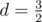

# F. Geometrical Progression

**time limit per test:** 4 seconds

**memory limit per test:** 256 megabytes

**input:** standard input

**output:** standard output

For given *n*, *l* and *r* find the number of distinct geometrical progression, each of which contains *n* distinct integers not less than *l* and not greater than *r*. In other words, for each progression the following must hold: *l* ≤ *a*~*i*~ ≤ *r* and *a*~*i*~ ≠ *a*~*j*~ , where *a*~1~, *a*~2~, ..., *a*~*n*~ is the geometrical progression, 1 ≤ *i*, *j* ≤ *n* and *i* ≠ *j*.

Geometrical progression is a sequence of numbers *a*~1~, *a*~2~, ..., *a*~*n*~ where each term after first is found by multiplying the previous one by a fixed non-zero number *d* called the common ratio. Note that in our task *d* may be non-integer. For example in progression 4, 6, 9, common ratio is



.

Two progressions *a*~1~, *a*~2~, ..., *a*~*n*~ and *b*~1~, *b*~2~, ..., *b*~*n*~ are considered different, if there is such *i* (1 ≤ *i* ≤ *n*) that *a*~*i*~ ≠ *b*~*i*~.

#### Input

The first and the only line cotains three integers *n*, *l* and *r* (1 ≤ *n* ≤ 10^7^, 1 ≤ *l* ≤ *r* ≤ 10^7^).

#### Output

Print the integer *K* — is the answer to the problem.

#### Examples

#### Input
```
1 1 10
```

#### Output
```
10
```

#### Input
```
2 6 9
```

#### Output
```
12
```

#### Input
```
3 1 10
```

#### Output
```
8
```

#### Input
```
3 3 10
```

#### Output
```
2
```

#### Note

These are possible progressions for the first test of examples:

- 1;
- 2;
- 3;
- 4;
- 5;
- 6;
- 7;
- 8;
- 9;
- 10.

These are possible progressions for the second test of examples:

- 6, 7;
- 6, 8;
- 6, 9;
- 7, 6;
- 7, 8;
- 7, 9;
- 8, 6;
- 8, 7;
- 8, 9;
- 9, 6;
- 9, 7;
- 9, 8.

These are possible progressions for the third test of examples:

- 1, 2, 4;
- 1, 3, 9;
- 2, 4, 8;
- 4, 2, 1;
- 4, 6, 9;
- 8, 4, 2;
- 9, 3, 1;
- 9, 6, 4.

These are possible progressions for the fourth test of examples:

- 4, 6, 9;
- 9, 6, 4.
