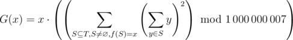
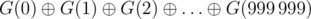
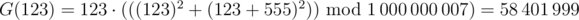
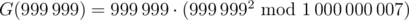
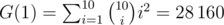
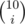

# D. Varying Kibibits

**time limit per test:** 3 seconds

**memory limit per test:** 256 megabytes

**input:** standard input

**output:** standard output

You are given *n* integers *a*~1~, *a*~2~, ..., *a*~*n*~. Denote this list of integers as *T*.

Let *f*(*L*) be a function that takes in a non-empty list of integers *L*.

The function will output another integer as follows:

- First, all integers in *L* are padded with leading zeros so they are all the same length as the maximum length number in *L*.
- We will construct a string where the *i*-th character is the minimum of the *i*-th character in padded input numbers.
- The output is the number representing the string interpreted in base 10.

For example *f*(10, 9) = 0, *f*(123, 321) = 121, *f*(530, 932, 81) = 30.

Define the function



 Here,


 denotes a subsequence.
In other words, *G*(*x*) is the sum of squares of sum of elements of nonempty subsequences of *T* that evaluate to *x* when plugged into *f* modulo 1 000 000 007, then multiplied by *x*. The last multiplication is not modded.

You would like to compute *G*(0), *G*(1), ..., *G*(999 999). To reduce the output size, print the value



, where


 denotes the bitwise XOR operator.

#### Input

The first line contains the integer *n* (1 ≤ *n* ≤ 1 000 000) — the size of list *T*.

The next line contains *n* space-separated integers, *a*~1~, *a*~2~, ..., *a*~*n*~ (0 ≤ *a*~*i*~ ≤ 999 999) — the elements of the list.

#### Output

Output a single integer, the answer to the problem.

#### Examples

#### Input
```
3
123 321 555
```

#### Output
```
292711924
```

#### Input
```
1
999999
```

#### Output
```
997992010006992
```

#### Input
```
10
1 1 1 1 1 1 1 1 1 1
```

#### Output
```
28160
```

#### Note

For the first sample, the nonzero values of *G* are *G*(121) = 144 611 577, *G*(123) = 58 401 999, *G*(321) = 279 403 857, *G*(555) = 170 953 875. The bitwise XOR of these numbers is equal to 292 711 924.

For example,



, since the subsequences [123] and [123, 555] evaluate to 123 when plugged into *f*.

For the second sample, we have



For the last sample, we have



, where



 is the binomial coefficient.
