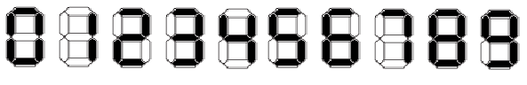

# C. Maximum Number

**time limit per test:** 1 second

**memory limit per test:** 256 megabytes

**input:** standard input

**output:** standard output

Stepan has the newest electronic device with a display. Different digits can be shown on it. Each digit is shown on a seven-section indicator like it is shown on the picture below.





So, for example, to show the digit 3 on the display, 5 sections must be highlighted; and for the digit 6, 6 sections must be highlighted.

The battery of the newest device allows to highlight at most *n* sections on the display.

Stepan wants to know the maximum possible integer number which can be shown on the display of his newest device. Your task is to determine this number. Note that this number must not contain leading zeros. Assume that the size of the display is enough to show any integer.

#### Input

The first line contains the integer *n* (2 ≤ *n* ≤ 100 000) — the maximum number of sections which can be highlighted on the display.

#### Output

Print the maximum integer which can be shown on the display of Stepan's newest device.

#### Examples

#### Input
```
2
```

#### Output
```
1
```

#### Input
```
3
```

#### Output
```
7
```
