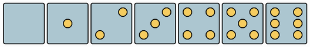
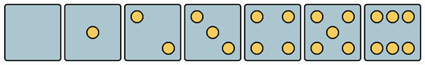
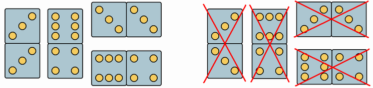
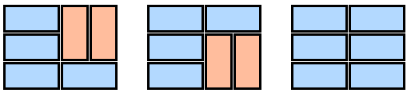
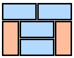

# D. Domino Carpet

**time limit per test:** 2 seconds

**memory limit per test:** 256 megabytes

**input:** stdin

**output:** stdout

...Mike the TV greets you again!

Tired of the monotonous furniture? Sick of gray routine? Dreaming about dizzying changes in your humble abode? We have something to offer you!

This domino carpet for only $99.99 will change your life! You can lay it on the floor, hang it on the wall or even on the ceiling! Among other things ...

Having watched the commercial, virus Hexadecimal also wanted to get a Domino Carpet and wanted badly to be photographed in front of it. But of course, a virus will never consent to buying a licensed Carpet! So she ordered a truck of dominoes and decided to make such a Carpet herself.

The original Domino Carpet is a field of squares *n* × *m* in size. Each square is half of a domino, and can be rotated either vertically or horizontally, independently from its neighbors. Vertically rotated domino halves look like this:





And horizontally rotated halves look like this:





Notice, that some halves looks the same in both rotations, but other halves differ.

Dominoes bought by Hexadecimal are represented by uncuttable chips 1 × 2 in size, which can be laid either vertically or horizontally. If the chip is laid vertically, then both of it's halves should be laid vertically orientated; if the chip is laid horizontally, then both of it's halves should be laid horizontally.

The samples of valid and invalid dominoes laid vertically and horizontally are:





Virus Hexadecimal assembles her own Domino Carpet so that the following conditions are satisfied:

- each carpet square is covered by a domino chip, i.e. there are no empty squares;
- all domino chips lie entirely within the carpet and don't overlap with each other;
- if there is a horizontal domino chip with its left half in column *j* then there are no horizontal domino chips with their left halves in columns *j* - 1 or *j* + 1.

Before starting to assemble her own Domino Carpet, the virus wants to know the number of ways to achieve the intended purpose modulo 10^9^ + 7.

You can assume that the virus has an infinitely large number of dominoes of each type.

#### Input

The first line contains two integers *n* and *m*, separated by a space — the size of the Domino Carpet (1 ≤ *n*, *m* ≤ 250). Next 4*n* + 1 lines contain 4*m* + 1 symbols.

Each square of the Domino Carpet, which is a domino half, is described by a 3 × 3 square. Symbol 'O' in this square indicates the presence of a point, symbol '.' — its absence.

Each 3 × 3 square is delineated from adjacent squares by symbols '#' as shown in the examples.

It is guaranteed that every box describes the correct half of a domino.

In all pretests the Domino Carpets have the size of 2 × 2 and 4 × 4.

#### Output

Print a single number, the number of ways to assemble the Domino Carpet modulo 10^9^ + 7, using only standard dominoes of size 1 × 2.

#### Examples

#### Input
```
3 4
#################
#O..#...#O.O#...#
#.O.#.O.#.O.#...#
#..O#...#O.O#...#
#################
#O.O#OOO#O.O#...#
#.O.#...#...#.O.#
#O.O#OOO#O.O#...#
#################
#O.O#...#O.O#...#
#...#...#...#.O.#
#O.O#...#O.O#...#
#################
```

#### Output
```
3
```

#### Input
```
2 2
#########
#O.O#O.O#
#.O.#...#
#O.O#O.O#
#########
#...#O.O#
#...#...#
#...#O.O#
#########
```

#### Output
```
2
```

#### Input
```
2 2
#########
#..O#O..#
#...#...#
#O..#..O#
#########
#O..#..O#
#...#...#
#..O#O..#
#########
```

#### Output
```
0
```

#### Note

A note to the first example: all correct ways to make Domino Carpet are represented below:





And this way is incorrect:



