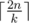
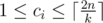

# E. Underground Lab

**time limit per test:** 1 second

**memory limit per test:** 256 megabytes

**input:** standard input

**output:** standard output

The evil Bumbershoot corporation produces clones for gruesome experiments in a vast underground lab. On one occasion, the corp cloned a boy Andryusha who was smarter than his comrades. Immediately Andryusha understood that something fishy was going on there. He rallied fellow clones to go on a feud against the evil corp, and they set out to find an exit from the lab. The corp had to reduce to destroy the lab complex.

The lab can be pictured as a connected graph with *n* vertices and *m* edges. *k* clones of Andryusha start looking for an exit in some of the vertices. Each clone can traverse any edge once per second. Any number of clones are allowed to be at any vertex simultaneously. Each clone is allowed to stop looking at any time moment, but he must look at his starting vertex at least. The exit can be located at any vertex of the lab, hence each vertex must be visited by at least one clone.

Each clone can visit at most



 vertices before the lab explodes.

Your task is to choose starting vertices and searching routes for the clones. Each route can have at most


 vertices.

#### Input

The first line contains three integers *n*, *m*, and *k* (1 ≤ *n* ≤ 2·10^5^, *n* - 1 ≤ *m* ≤ 2·10^5^, 1 ≤ *k* ≤ *n*) — the number of vertices and edges in the lab, and the number of clones.

Each of the next *m* lines contains two integers *x*~*i*~ and *y*~*i*~ (1 ≤ *x*~*i*~, *y*~*i*~ ≤ *n*) — indices of vertices connected by the respective edge. The graph is allowed to have self-loops and multiple edges.

The graph is guaranteed to be connected.

#### Output

You should print *k* lines. *i*-th of these lines must start with an integer *c*~*i*~ (



) — the number of vertices visited by *i*-th clone, followed by *c*~*i*~ integers — indices of vertices visited by this clone in the order of visiting. You have to print each vertex every time it is visited, regardless if it was visited earlier or not.

It is guaranteed that a valid answer exists.

#### Examples

#### Input
```
3 2 1
2 1
3 1
```

#### Output
```
3 2 1 3
```

#### Input
```
5 4 2
1 2
1 3
1 4
1 5
```

#### Output
```
3 2 1 3
3 4 1 5
```

#### Note

In the first sample case there is only one clone who may visit vertices in order (2, 1, 3), which fits the constraint of 6 vertices per clone.

In the second sample case the two clones can visited vertices in order (2, 1, 3) and (4, 1, 5), which fits the constraint of 5 vertices per clone.
