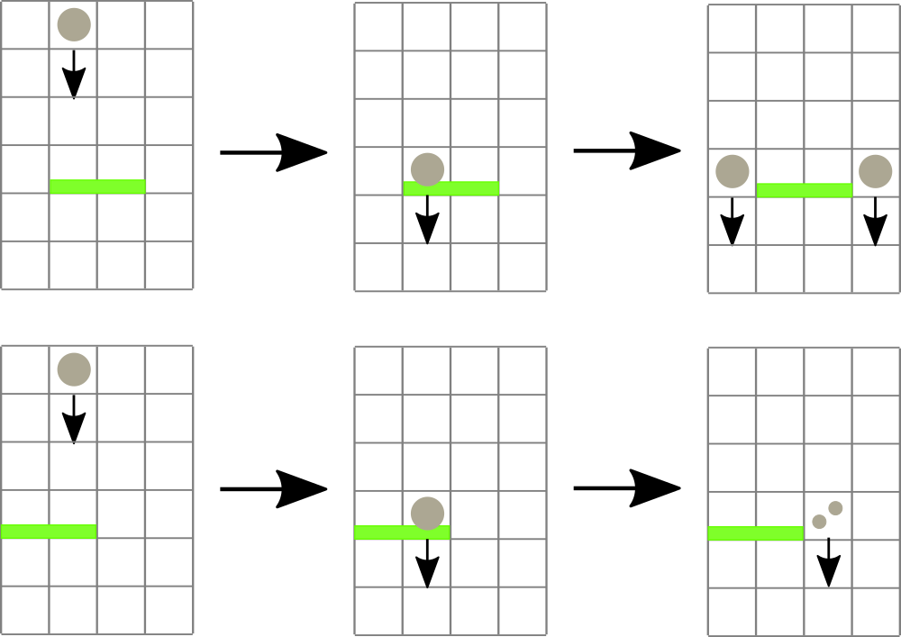
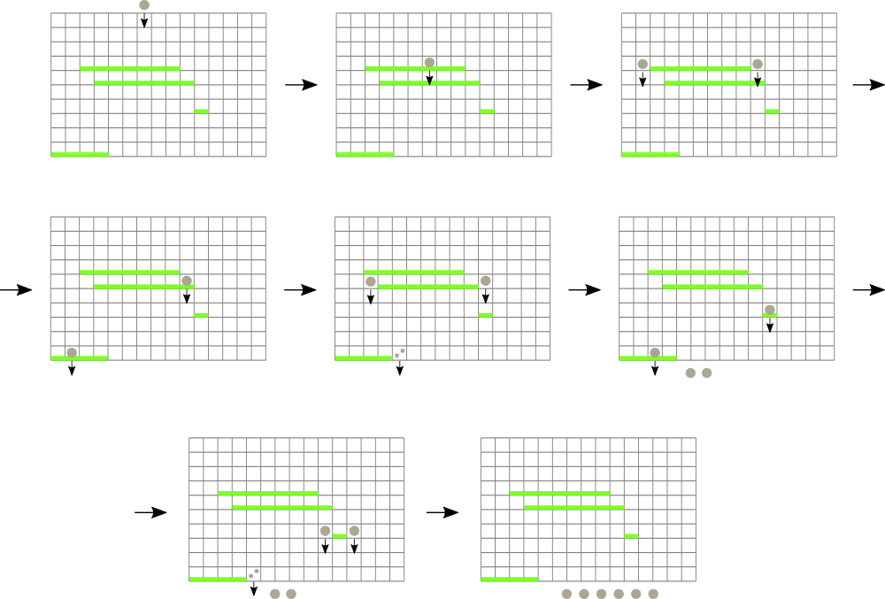

# G. Andryusha and Nervous Barriers

**time limit per test:** 4 seconds

**memory limit per test:** 256 megabytes

**input:** standard input

**output:** standard output

Andryusha has found a perplexing arcade machine. The machine is a vertically adjusted board divided into square cells. The board has *w* columns numbered from 1 to *w* from left to right, and *h* rows numbered from 1 to *h* from the bottom to the top.

Further, there are barriers in some of board rows. There are *n* barriers in total, and *i*-th of them occupied the cells *l*~*i*~ through *r*~*i*~ of the row *u*~*i*~. Andryusha recollects well that no two barriers share the same row. Furthermore, no row is completely occupied with a barrier, that is, at least one cell in each row is free.

The player can throw a marble to any column of the machine from above. A marble falls downwards until it encounters a barrier, or falls through the bottom of the board. A marble disappears once it encounters a barrier but is replaced by two more marbles immediately to the left and to the right of the same barrier. In a situation when the barrier is at an edge of the board, both marbles appear next to the barrier at the side opposite to the edge. More than one marble can occupy the same place of the board, without obstructing each other's movement. Ultimately, all marbles are bound to fall from the bottom of the machine.




 Examples of marble-barrier interaction.
Peculiarly, sometimes marbles can go through barriers as if they were free cells. That is so because the barriers are in fact alive, and frightened when a marble was coming at them from a very high altitude. More specifically, if a marble falls towards the barrier *i* from relative height more than *s*~*i*~ (that is, it started its fall strictly higher than *u*~*i*~ + *s*~*i*~), then the barrier evades the marble. If a marble is thrown from the top of the board, it is considered to appear at height (*h* + 1).

Andryusha remembers to have thrown a marble once in each of the columns. Help him find the total number of marbles that came down at the bottom of the machine. Since the answer may be large, print it modulo 10^9^ + 7.

#### Input

The first line contains three integers *h*, *w*, and *n* (1 ≤ *h* ≤ 10^9^, 2 ≤ *w* ≤ 10^5^, 0 ≤ *n* ≤ 10^5^) — the number of rows, columns, and barriers in the machine respectively.

Next *n* lines describe barriers. *i*-th of these lines containts four integers *u*~*i*~, *l*~*i*~, *r*~*i*~, and *s*~*i*~ (1 ≤ *u*~*i*~ ≤ *h*, 1 ≤ *l*~*i*~ ≤ *r*~*i*~ ≤ *w*, 1 ≤ *s*~*i*~ ≤ 10^9^) — row index, leftmost and rightmost column index of *i*-th barrier, and largest relative fall height such that the barrier does not evade a falling marble. It is guaranteed that each row has at least one free cell, and that all *u*~*i*~ are distinct.

#### Output

Print one integer — the answer to the problem modulo 10^9^ + 7.

#### Examples

#### Input
```
10 5 1
3 2 3 10
```

#### Output
```
7
```

#### Input
```
10 5 2
3 1 3 10
5 3 5 10
```

#### Output
```
16
```

#### Input
```
10 5 2
3 1 3 7
5 3 5 10
```

#### Output
```
14
```

#### Input
```
10 15 4
7 3 9 5
6 4 10 1
1 1 4 10
4 11 11 20
```

#### Output
```
53
```

#### Note

In the first sample case, there is a single barrier: if one throws a marble in the second or the third column, two marbles come out, otherwise there is only one. The total answer is 7.

In the second sample case, the numbers of resulting marbles are 2, 2, 4, 4, 4 in order of indexing columns with the initial marble.

In the third sample case, the numbers of resulting marbles are 1, 1, 4, 4, 4. Note that the first barrier evades the marbles falling from the top of the board, but does not evade the marbles falling from the second barrier.

In the fourth sample case, the numbers of resulting marbles are 2, 2, 6, 6, 6, 6, 6, 6, 6, 1, 2, 1, 1, 1, 1. The picture below shows the case when a marble is thrown into the seventh column.




 The result of throwing a marble into the seventh column.
