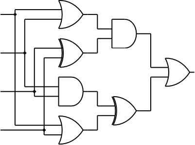

# E. Twisted Circuit

**time limit per test:** 2 seconds

**memory limit per test:** 64 megabytes

**input:** standard input

**output:** standard output





#### Input

The input consists of four lines, each line containing a single digit 0 or 1.

#### Output

Output a single digit, 0 or 1.

#### Example

#### Input
```
0
1
1
0
```

#### Output
```
0
```
