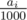
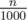
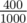
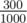
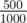
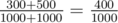
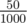
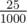
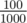
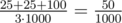

# C. The Great Mixing

**time limit per test:** 1 second

**memory limit per test:** 256 megabytes

**input:** standard input

**output:** standard output

Sasha and Kolya decided to get drunk with Coke, again. This time they have *k* types of Coke. *i*-th type is characterised by its carbon dioxide concentration



. Today, on the party in honour of Sergiy of Vancouver they decided to prepare a glass of Coke with carbon dioxide concentration



. The drink should also be tasty, so the glass can contain only integer number of liters of each Coke type (some types can be not presented in the glass). Also, they want to minimize the total volume of Coke in the glass.

Carbon dioxide concentration is defined as the volume of carbone dioxide in the Coke divided by the total volume of Coke. When you mix two Cokes, the volume of carbon dioxide sums up, and the total volume of Coke sums up as well.

Help them, find the minimal natural number of liters needed to create a glass with carbon dioxide concentration


. Assume that the friends have unlimited amount of each Coke type.

#### Input

The first line contains two integers *n*, *k* (0 ≤ *n* ≤ 1000, 1 ≤ *k* ≤ 10^6^) — carbon dioxide concentration the friends want and the number of Coke types.

The second line contains *k* integers *a*~1~, *a*~2~, ..., *a*~*k*~ (0 ≤ *a*~*i*~ ≤ 1000) — carbon dioxide concentration of each type of Coke. Some Coke types can have same concentration.

#### Output

Print the minimal natural number of liter needed to prepare a glass with carbon dioxide concentration


, or -1 if it is impossible.

#### Examples

#### Input
```
400 4
100 300 450 500
```

#### Output
```
2
```

#### Input
```
50 2
100 25
```

#### Output
```
3
```

#### Note

In the first sample case, we can achieve concentration



 using one liter of Coke of types



 and



:



.

In the second case, we can achieve concentration



 using two liters of



 type and one liter of



 type:



.
