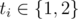

# F. Sequence Recovery

**time limit per test:** 2 seconds

**memory limit per test:** 256 megabytes

**input:** standard input

**output:** standard output

Zane once had a good sequence *a* consisting of *n* integers *a*~1~, *a*~2~, ..., *a*~*n*~ — but he has lost it.

A sequence is said to be good if and only if all of its integers are non-negative and do not exceed 10^9^ in value.


However, Zane remembers having played around with his sequence by applying *m* operations to it.

There are two types of operations:

1. Find the maximum value of integers with indices *i* such that *l* ≤ *i* ≤ *r*, given *l* and *r*.

2. Assign *d* as the value of the integer with index *k*, given *k* and *d*.

After he finished playing, he restored his sequence to the state it was before any operations were applied. That is, sequence *a* was no longer affected by the applied type 2 operations. Then, he lost his sequence at some time between now and then.

Fortunately, Zane remembers all the operations and the order he applied them to his sequence, along with the distinct results of all type 1 operations. Moreover, among all good sequences that would produce the same results when the same operations are applied in the same order, he knows that his sequence *a* has the greatest cuteness.

We define cuteness of a sequence as the bitwise OR result of all integers in such sequence. For example, the cuteness of Zane's sequence *a* is *a*~1~ OR *a*~2~ OR ... OR *a*~*n*~.

Zane understands that it might not be possible to recover exactly the lost sequence given his information, so he would be happy to get any good sequence *b* consisting of *n* integers *b*~1~, *b*~2~, ..., *b*~*n*~ that:

1. would give the same results when the same operations are applied in the same order, and

2. has the same cuteness as that of Zane's original sequence *a*.

If there is such a sequence, find it. Otherwise, it means that Zane must have remembered something incorrectly, which is possible.

#### Input

The first line contains two integers *n* and *m* (1 ≤ *n*, *m* ≤ 3·10^5^) — the number of integers in Zane's original sequence and the number of operations that have been applied to the sequence, respectively.

The *i*-th of the following *m* lines starts with one integer *t*~*i*~ (



) — the type of the *i*-th operation.

If the operation is type 1 (*t*~*i*~ = 1), then three integers *l*~*i*~, *r*~*i*~, and *x*~*i*~ follow (1 ≤ *l*~*i*~ ≤ *r*~*i*~ ≤ *n*, 0 ≤ *x*~*i*~ ≤ 10^9^) — the leftmost index to be considered, the rightmost index to be considered, and the maximum value of all integers with indices between *l*~*i*~ and *r*~*i*~, inclusive, respectively.

If the operation is type 2 (*t*~*i*~ = 2), then two integers *k*~*i*~ and *d*~*i*~ follow (1 ≤ *k*~*i*~ ≤ *n*, 0 ≤ *d*~*i*~ ≤ 10^9^) — meaning that the integer with index *k*~*i*~ should become *d*~*i*~ after this operation.

It is guaranteed that *x*~*i*~ ≠ *x*~*j*~ for all pairs (*i*, *j*) where 1 ≤ *i* < *j* ≤ *m* and *t*~*i*~ = *t*~*j*~ = 1.

The operations are given in the same order they were applied. That is, the operation that is given first was applied first, the operation that is given second was applied second, and so on.

#### Output

If there does not exist a valid good sequence, print "NO" (without quotation marks) in the first line.

Otherwise, print "YES" (without quotation marks) in the first line, and print *n* space-separated integers *b*~1~, *b*~2~, ..., *b*~*n*~ (0 ≤ *b*~*i*~ ≤ 10^9^) in the second line.

If there are multiple answers, print any of them.

#### Examples

#### Input
```
5 4
1 1 5 19
1 2 5 1
2 5 100
1 1 5 100
```

#### Output
```
YES
19 0 0 0 1
```

#### Input
```
5 2
1 1 5 0
1 1 5 100
```

#### Output
```
NO
```

#### Note

In the first sample, it is easy to verify that this good sequence is valid. In particular, its cuteness is 19 OR 0 OR 0 OR 0 OR 1  =  19.

In the second sample, the two operations clearly contradict, so there is no such good sequence.
