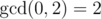

# C. Mike and gcd problem

**time limit per test:** 2 seconds

**memory limit per test:** 256 megabytes

**input:** standard input

**output:** standard output

Mike has a sequence *A* = [*a*~1~, *a*~2~, ..., *a*~*n*~] of length *n*. He considers the sequence *B* = [*b*~1~, *b*~2~, ..., *b*~*n*~] beautiful if the *gcd* of all its elements is bigger than 1, i.e.


.

Mike wants to change his sequence in order to make it beautiful. In one move he can choose an index *i* (1 ≤ *i* < *n*), delete numbers *a*~*i*~, *a*~*i* + 1~ and put numbers *a*~*i*~ - *a*~*i* + 1~, *a*~*i*~ + *a*~*i* + 1~ in their place instead, in this order. He wants perform as few operations as possible. Find the minimal number of operations to make sequence *A* beautiful if it's possible, or tell him that it is impossible to do so.


 is the biggest non-negative number *d* such that *d* divides *b*~*i*~ for every *i* (1 ≤ *i* ≤ *n*).

#### Input

The first line contains a single integer *n* (2 ≤ *n* ≤ 100 000) — length of sequence *A*.

The second line contains *n* space-separated integers *a*~1~, *a*~2~, ..., *a*~*n*~ (1 ≤ *a*~*i*~ ≤ 10^9^) — elements of sequence *A*.

#### Output

Output on the first line "YES" (without quotes) if it is possible to make sequence *A* beautiful by performing operations described above, and "NO" (without quotes) otherwise.

If the answer was "YES", output the minimal number of moves needed to make sequence *A* beautiful.

#### Examples

#### Input
```
2
1 1
```

#### Output
```
YES
1
```

#### Input
```
3
6 2 4
```

#### Output
```
YES
0
```

#### Input
```
2
1 3
```

#### Output
```
YES
1
```

#### Note

In the first example you can simply make one move to obtain sequence [0, 2] with



.

In the second example the *gcd* of the sequence is already greater than 1.
