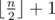

# D. Mike and distribution

**time limit per test:** 2 seconds

**memory limit per test:** 256 megabytes

**input:** standard input

**output:** standard output

Mike has always been thinking about the harshness of social inequality. He's so obsessed with it that sometimes it even affects him while solving problems. At the moment, Mike has two sequences of positive integers *A* = [*a*~1~, *a*~2~, ..., *a*~*n*~] and *B* = [*b*~1~, *b*~2~, ..., *b*~*n*~] of length *n* each which he uses to ask people some quite peculiar questions.

To test you on how good are you at spotting inequality in life, he wants you to find an "unfair" subset of the original sequence. To be more precise, he wants you to select *k* numbers *P* = [*p*~1~, *p*~2~, ..., *p*~*k*~] such that 1 ≤ *p*~*i*~ ≤ *n* for 1 ≤ *i* ≤ *k* and elements in *P* are distinct. Sequence *P* will represent indices of elements that you'll select from both sequences. He calls such a subset *P* "unfair" if and only if the following conditions are satisfied: 2·(*a*~*p*~1~~ + ... + *a*~*p*~*k*~~) is greater than the sum of all elements from sequence *A*, and 2·(*b*~*p*~1~~ + ... + *b*~*p*~*k*~~) is greater than the sum of all elements from the sequence *B*. Also, *k* should be smaller or equal to


 because it will be to easy to find sequence *P* if he allowed you to select too many elements!

Mike guarantees you that a solution will always exist given the conditions described above, so please help him satisfy his curiosity!

#### Input

The first line contains integer *n* (1 ≤ *n* ≤ 10^5^) — the number of elements in the sequences.

On the second line there are *n* space-separated integers *a*~1~, ..., *a*~*n*~ (1 ≤ *a*~*i*~ ≤ 10^9^) — elements of sequence *A*.

On the third line there are also *n* space-separated integers *b*~1~, ..., *b*~*n*~ (1 ≤ *b*~*i*~ ≤ 10^9^) — elements of sequence *B*.

#### Output

On the first line output an integer *k* which represents the size of the found subset. *k* should be less or equal to



.

On the next line print *k* integers *p*~1~, *p*~2~, ..., *p*~*k*~ (1 ≤ *p*~*i*~ ≤ *n*) — the elements of sequence *P*. You can print the numbers in any order you want. Elements in sequence *P* should be distinct.

#### Example

#### Input
```
5
8 7 4 8 3
4 2 5 3 7
```

#### Output
```
3
1 4 5
```
