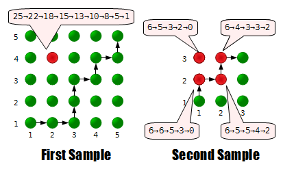

# E. Security System

**time limit per test:** 1 second

**memory limit per test:** 256 megabytes

**input:** stdin

**output:** stdout

Fox Ciel safely returned to her castle, but there was something wrong with the security system of the castle: sensors attached in the castle were covering her.

Ciel is at point (1, 1) of the castle now, and wants to move to point (*n*, *n*), which is the position of her room. By one step, Ciel can move from point (*x*, *y*) to either (*x* + 1, *y*) (rightward) or (*x*, *y* + 1) (upward).

In her castle, *c*^2^ sensors are set at points (*a* + *i*, *b* + *j*) (for every integer *i* and *j* such that: 0 ≤ *i* < *c*, 0 ≤ *j* < *c*).

Each sensor has a count value and decreases its count value every time Ciel moves. Initially, the count value of each sensor is *t*. Every time Ciel moves to point (*x*, *y*), the count value of a sensor at point (*u*, *v*) decreases by (|*u* - *x*| + |*v* - *y*|). When the count value of some sensor becomes strictly less than 0, the sensor will catch Ciel as a suspicious individual!

Determine whether Ciel can move from (1, 1) to (*n*, *n*) without being caught by a sensor, and if it is possible, output her steps. Assume that Ciel can move to every point even if there is a censor on the point.

#### Input

In the first line there are five integers *n*, *t*, *a*, *b*, *c* (2 ≤ *n* ≤ 2·10^5^,  0 ≤ *t* ≤ 10^14^,  1 ≤ *a* ≤ *n* - *c* + 1,  1 ≤ *b* ≤ *n* - *c* + 1,  1 ≤ *c* ≤ *n*).

Please do not use the %lld specificator to read or write 64-bit integers in C++. It is preferred to use the cin stream (also you may use the %I64d specificator).

#### Output

If Ciel's objective is possible, output in first line 2*n* - 2 characters that represent her feasible steps, where *i*-th character is R if *i*-th step is moving rightward, or U if moving upward. If there are several solution, output lexicographically first one. Character R is lexicographically earlier than the character U.

If her objective is impossible, output Impossible.

#### Examples

#### Input
```
5 25 2 4 1
```

#### Output
```
RRUURURU
```

#### Input
```
3 6 1 2 2
```

#### Output
```
URUR
```

#### Input
```
3 5 1 2 2
```

#### Output
```
Impossible
```

#### Input
```
20 492 11 4 8
```

#### Output
```
RRRRRRRRRRRRRRRRUUUUURUUUUURRUUUUUUUUU
```

#### Note

The answers for the first sample and the second sample are shown on the picture:




 Here, a red point represents a point that contains a sensor.
