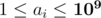
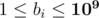

# M2. April Fools' Problem (medium)

**time limit per test:** 4 seconds

**memory limit per test:** 256 megabytes

**input:** standard input

**output:** standard output

The marmots need to prepare *k* problems for HC^2^ over *n* days. Each problem, once prepared, also has to be printed.

The preparation of a problem on day *i* (at most one per day) costs *a*~*i*~ CHF, and the printing of a problem on day *i* (also at most one per day) costs *b*~*i*~ CHF. Of course, a problem cannot be printed before it has been prepared (but doing both on the same day is fine).

What is the minimum cost of preparation and printing?

#### Input

The first line of input contains two space-separated integers *n* and *k* (1 ≤ *k* ≤ *n* ≤ 2200). The second line contains *n* space-separated integers *a*~1~, ..., *a*~*n*~ (



) — the preparation costs. The third line contains *n* space-separated integers *b*~1~, ..., *b*~*n*~ (



) — the printing costs.

#### Output

Output the minimum cost of preparation and printing *k* problems — that is, the minimum possible sum *a*~*i*~1~~ + *a*~*i*~2~~ + ... + *a*~*i*~*k*~~ + *b*~*j*~1~~ + *b*~*j*~2~~ + ... + *b*~*j*~*k*~~, where 1 ≤ *i*~1~ < *i*~2~ < ... < *i*~*k*~ ≤ *n*, 1 ≤ *j*~1~ < *j*~2~ < ... < *j*~*k*~ ≤ *n* and *i*~1~ ≤ *j*~1~, *i*~2~ ≤ *j*~2~, ..., *i*~*k*~ ≤ *j*~*k*~.

#### Example

#### Input
```
8 4
3 8 7 9 9 4 6 8
2 5 9 4 3 8 9 1
```

#### Output
```
32
```

#### Note

In the sample testcase, one optimum solution is to prepare the first problem on day 1 and print it on day 1, prepare the second problem on day 2 and print it on day 4, prepare the third problem on day 3 and print it on day 5, and prepare the fourth problem on day 6 and print it on day 8.
