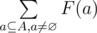
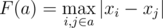
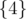
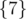
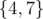
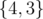
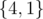
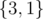
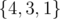

# A. Do you want a date?

**time limit per test:** 2 seconds

**memory limit per test:** 256 megabytes

**input:** standard input

**output:** standard output

Leha decided to move to a quiet town Vičkopolis, because he was tired by living in Bankopolis. Upon arrival he immediately began to expand his network of hacked computers. During the week Leha managed to get access to *n* computers throughout the town. Incidentally all the computers, which were hacked by Leha, lie on the same straight line, due to the reason that there is the only one straight street in Vičkopolis.

Let's denote the coordinate system on this street. Besides let's number all the hacked computers with integers from 1 to *n*. So the *i*-th hacked computer is located at the point *x*~*i*~. Moreover the coordinates of all computers are distinct.

Leha is determined to have a little rest after a hard week. Therefore he is going to invite his friend Noora to a restaurant. However the girl agrees to go on a date with the only one condition: Leha have to solve a simple task.

Leha should calculate a sum of *F*(*a*) for all *a*, where *a* is a non-empty subset of the set, that consists of all hacked computers. Formally, let's denote *A* the set of all integers from 1 to *n*. Noora asks the hacker to find value of the expression



. Here *F*(*a*) is calculated as the maximum among the distances between all pairs of computers from the set *a*. Formally,



. Since the required sum can be quite large Noora asks to find it modulo 10^9^ + 7.

Though, Leha is too tired. Consequently he is not able to solve this task. Help the hacker to attend a date.

#### Input

The first line contains one integer *n* (1 ≤ *n* ≤ 3·10^5^) denoting the number of hacked computers.

The second line contains *n* integers *x*~1~, *x*~2~, ..., *x*~*n*~ (1 ≤ *x*~*i*~ ≤ 10^9^) denoting the coordinates of hacked computers. It is guaranteed that all *x*~*i*~ are distinct.

#### Output

Print a single integer — the required sum modulo 10^9^ + 7.

#### Examples

#### Input
```
2
4 7
```

#### Output
```
3
```

#### Input
```
3
4 3 1
```

#### Output
```
9
```

#### Note

There are three non-empty subsets in the first sample test:



,



 and



. The first and the second subset increase the sum by 0 and the third subset increases the sum by 7 - 4 = 3. In total the answer is 0 + 0 + 3 = 3.

There are seven non-empty subsets in the second sample test. Among them only the following subsets increase the answer:



,



,



,



. In total the sum is (4 - 3) + (4 - 1) + (3 - 1) + (4 - 1) = 9.
