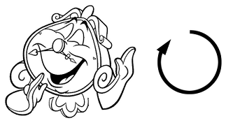

# B. Depression

**time limit per test:** 1 second

**memory limit per test:** 256 megabytes

**input:** stdin

**output:** stdout

Do you remember a kind cartoon "Beauty and the Beast"? No, no, there was no firing from machine guns or radiation mutants time-travels!

There was a beauty named Belle. Once she had violated the Beast's order and visited the West Wing. After that she was banished from the castle...

Everybody was upset. The beautiful Belle was upset, so was the Beast, so was Lumiere the candlestick. But the worst thing was that Cogsworth was upset. Cogsworth is not a human, but is the mantel clock, which was often used as an alarm clock.

Due to Cogsworth's frustration all the inhabitants of the castle were in trouble: now they could not determine when it was time to drink morning tea, and when it was time for an evening stroll.

Fortunately, deep in the basement are lying digital clock showing the time in the format HH:MM. Now the residents of the castle face a difficult task. They should turn Cogsworth's hour and minute mustache hands in such a way, that Cogsworth began to show the correct time. Moreover they need to find turn angles in degrees for each mustache hands. The initial time showed by Cogsworth is 12:00.

You can only rotate the hands forward, that is, as is shown in the picture:





As since there are many ways too select such angles because of full rotations, choose the smallest angles in the right (non-negative) direction.

Note that Cogsworth's hour and minute mustache hands move evenly and continuously. Hands are moving independently, so when turning one hand the other hand remains standing still.

#### Input

The only line of input contains current time according to the digital clock, formatted as HH:MM ($00 \le$HH$\le 23$, $00 \le$MM$\le 59$). The mantel clock initially shows 12:00.

Pretests contain times of the beginning of some morning TV programs of the Channel One Russia.

#### Output

Print two numbers $x$ and $y$ — the angles of turning the hour and minute hands, respectively ($0 \le x,y \lt 360$). The absolute or relative error in the answer should not exceed $10^{-9}$.

#### Examples

#### Input
```
12:00
```

#### Output
```
0 0
```

#### Input
```
04:30
```

#### Output
```
135 180
```

#### Input
```
08:17
```

#### Output
```
248.5 102
```

#### Note

A note to the second example: the hour hand will be positioned exactly in the middle, between 4 and 5.
