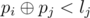
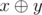
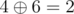
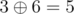

# E. Choosing The Commander

**time limit per test:** 2 seconds

**memory limit per test:** 256 megabytes

**input:** standard input

**output:** standard output

As you might remember from the previous round, Vova is currently playing a strategic game known as Rage of Empires.

Vova managed to build a large army, but forgot about the main person in the army - the commander. So he tries to hire a commander, and he wants to choose the person who will be respected by warriors.

Each warrior is represented by his personality — an integer number *p*~*i*~. Each commander has two characteristics — his personality *p*~*j*~ and leadership *l*~*j*~ (both are integer numbers). Warrior *i* respects commander *j* only if



 (



 is the bitwise excluding OR of *x* and *y*).

Initially Vova's army is empty. There are three different types of events that can happen with the army:

- 1 *p*~*i*~ — one warrior with personality *p*~*i*~ joins Vova's army;
- 2 *p*~*i*~ — one warrior with personality *p*~*i*~ leaves Vova's army;
- 3 *p*~*i*~ *l*~*i*~ — Vova tries to hire a commander with personality *p*~*i*~ and leadership *l*~*i*~.

For each event of the third type Vova wants to know how many warriors (counting only those who joined the army and haven't left yet) respect the commander he tries to hire.

#### Input

The first line contains one integer *q* (1 ≤ *q* ≤ 100000) — the number of events.

Then *q* lines follow. Each line describes the event:

- 1 *p*~*i*~ (1 ≤ *p*~*i*~ ≤ 10^8^) — one warrior with personality *p*~*i*~ joins Vova's army;
- 2 *p*~*i*~ (1 ≤ *p*~*i*~ ≤ 10^8^) — one warrior with personality *p*~*i*~ leaves Vova's army (it is guaranteed that there is at least one such warrior in Vova's army by this moment);
- 3 *p*~*i*~ *l*~*i*~ (1 ≤ *p*~*i*~, *l*~*i*~ ≤ 10^8^) — Vova tries to hire a commander with personality *p*~*i*~ and leadership *l*~*i*~. There is at least one event of this type.

#### Output

For each event of the third type print one integer — the number of warriors who respect the commander Vova tries to hire in the event.

#### Example

#### Input
```
5
1 3
1 4
3 6 3
2 4
3 6 3
```

#### Output
```
1
0
```

#### Note

In the example the army consists of two warriors with personalities 3 and 4 after first two events. Then Vova tries to hire a commander with personality 6 and leadership 3, and only one warrior respects him (



, and 2 < 3, but



, and 5 ≥ 3). Then warrior with personality 4 leaves, and when Vova tries to hire that commander again, there are no warriors who respect him.
