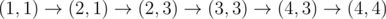
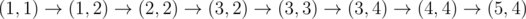
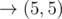

# D. Okabe and City

**time limit per test:** 4 seconds

**memory limit per test:** 256 megabytes

**input:** standard input

**output:** standard output

Okabe likes to be able to walk through his city on a path lit by street lamps. That way, he doesn't get beaten up by schoolchildren.

Okabe's city is represented by a 2D grid of cells. Rows are numbered from 1 to *n* from top to bottom, and columns are numbered 1 to *m* from left to right. Exactly *k* cells in the city are lit by a street lamp. It's guaranteed that the top-left cell is lit.

Okabe starts his walk from the top-left cell, and wants to reach the bottom-right cell. Of course, Okabe will only walk on lit cells, and he can only move to adjacent cells in the up, down, left, and right directions. However, Okabe can also temporarily light all the cells in any single row or column at a time if he pays 1 coin, allowing him to walk through some cells not lit initially.

Note that Okabe can only light a single row or column at a time, and has to pay a coin every time he lights a new row or column. To change the row or column that is temporarily lit, he must stand at a cell that is lit initially. Also, once he removes his temporary light from a row or column, all cells in that row/column not initially lit are now not lit.

Help Okabe find the minimum number of coins he needs to pay to complete his walk!

#### Input

The first line of input contains three space-separated integers *n*, *m*, and *k* (2 ≤ *n*, *m*, *k* ≤ 10^4^).

Each of the next *k* lines contains two space-separated integers *r*~*i*~ and *c*~*i*~ (1 ≤ *r*~*i*~ ≤ *n*, 1 ≤ *c*~*i*~ ≤ *m*) — the row and the column of the *i*-th lit cell.

It is guaranteed that all *k* lit cells are distinct. It is guaranteed that the top-left cell is lit.

#### Output

Print the minimum number of coins Okabe needs to pay to complete his walk, or -1 if it's not possible.

#### Examples

#### Input
```
4 4 5
1 1
2 1
2 3
3 3
4 3
```

#### Output
```
2
```

#### Input
```
5 5 4
1 1
2 1
3 1
3 2
```

#### Output
```
-1
```

#### Input
```
2 2 4
1 1
1 2
2 1
2 2
```

#### Output
```
0
```

#### Input
```
5 5 4
1 1
2 2
3 3
4 4
```

#### Output
```
3
```

#### Note

In the first sample test, Okabe can take the path



, paying only when moving to (2, 3) and (4, 4).

In the fourth sample, Okabe can take the path






, paying when moving to (1, 2), (3, 4), and (5, 4).
