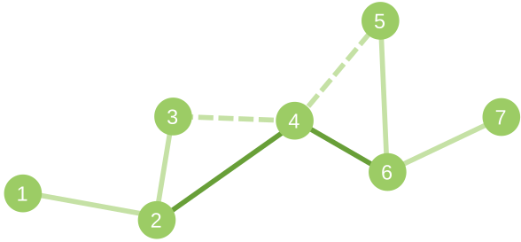

# C. Upgrading Tree

**time limit per test:** 4 seconds

**memory limit per test:** 512 megabytes

**input:** standard input

**output:** standard output

You are given a tree with *n* vertices and you are allowed to perform no more than 2*n* transformations on it. Transformation is defined by three vertices *x*, *y*, *y*' and consists of deleting edge (*x*, *y*) and adding edge (*x*, *y*'). Transformation *x*, *y*, *y*' could be performed if all the following conditions are satisfied:

- There is an edge (*x*, *y*) in the current tree.
- After the transformation the graph remains a tree.
- After the deletion of edge (*x*, *y*) the tree would consist of two connected components. Let's denote the set of nodes in the component containing vertex *x* by *V*~*x*~, and the set of nodes in the component containing vertex *y* by *V*~*y*~. Then condition |*V*~*x*~| > |*V*~*y*~| should be satisfied, i.e. the size of the component with *x* should be strictly larger than the size of the component with *y*.

You should minimize the sum of squared distances between all pairs of vertices in a tree, which you could get after no more than 2*n* transformations and output any sequence of transformations leading initial tree to such state.

Note that you don't need to minimize the number of operations. It is necessary to minimize only the sum of the squared distances.

#### Input

The first line of input contains integer *n* (1 ≤ *n* ≤ 2·10^5^) — number of vertices in tree.

The next *n* - 1 lines of input contains integers *a* and *b* (1 ≤ *a*, *b* ≤ *n*, *a* ≠ *b*) — the descriptions of edges. It is guaranteed that the given edges form a tree.

#### Output

In the first line output integer *k* (0 ≤ *k* ≤ 2*n*) — the number of transformations from your example, minimizing sum of squared distances between all pairs of vertices.

In each of the next *k* lines output three integers *x*, *y*, *y*' — indices of vertices from the corresponding transformation.

Transformations with *y* = *y*' are allowed (even though they don't change tree) if transformation conditions are satisfied.

If there are several possible answers, print any of them.

#### Examples

#### Input
```
3
3 2
1 3
```

#### Output
```
0
```

#### Input
```
7
1 2
2 3
3 4
4 5
5 6
6 7
```

#### Output
```
2
4 3 2
4 5 6
```

#### Note

This is a picture for the second sample. Added edges are dark, deleted edges are dotted.


