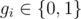
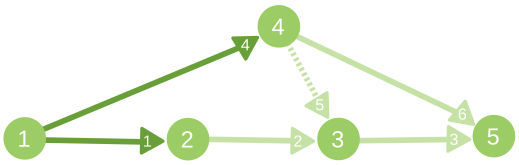

# E. Maximum Flow

**time limit per test:** 1 second

**memory limit per test:** 256 megabytes

**input:** standard input

**output:** standard output

You are given a directed graph, consisting of *n* vertices and *m* edges. The vertices *s* and *t* are marked as source and sink correspondingly. Additionally, there are no edges ending at *s* and there are no edges beginning in *t*.

The graph was constructed in a following way: initially each edge had capacity *c*~*i*~ > 0. A maximum flow with source at *s* and sink at *t* was constructed in this flow network. Let's denote *f*~*i*~ as the value of flow passing through edge with index *i*. Next, all capacities *c*~*i*~ and flow value *f*~*i*~ were erased. Instead, indicators *g*~*i*~ were written on edges — if flow value passing through edge *i* was positive, i.e. 1 if *f*~*i*~ > 0 and 0 otherwise.

Using the graph and values *g*~*i*~, find out what is the minimum possible number of edges in the initial flow network that could be saturated (the passing flow is equal to capacity, i.e. *f*~*i*~ = *c*~*i*~). Also construct the corresponding flow network with maximum flow in it.

A flow in directed graph is described by flow values *f*~*i*~ on each of the edges so that the following conditions are satisfied:

- for each vertex, except source and sink, total incoming flow and total outcoming flow are equal,
- for each edge 0 ≤ *f*~*i*~ ≤ *c*~*i*~

A flow is maximum if the difference between the sum of flow values on edges from the source, and the sum of flow values on edges to the source (there are no such in this problem), is maximum possible.

#### Input

The first line of input data contains four positive integers *n*, *m*, *s*, *t* (2 ≤ *n* ≤ 100, 1 ≤ *m* ≤ 1000, 1 ≤ *s*, *t* ≤ *n*, *s* ≠ *t*) — the number of vertices, the number of edges, index of source vertex and index of sink vertex correspondingly.

Each of next *m* lines of input data contain non-negative integers *u*~*i*~, *v*~*i*~, *g*~*i*~ (1 ≤ *u*~*i*~, *v*~*i*~ ≤ *n*,



) — the beginning of edge *i*, the end of edge *i* and indicator, which equals to 1 if flow value passing through edge *i* was positive and 0 if not.

It's guaranteed that no edge connects vertex with itself. Also it's guaranteed that there are no more than one edge between each ordered pair of vertices and that there exists at least one network flow that satisfies all the constrains from input data.

#### Output

In the first line print single non-negative integer *k* — minimum number of edges, which should be saturated in maximum flow.

In each of next *m* lines print two integers *f*~*i*~, *c*~*i*~ (1 ≤ *c*~*i*~ ≤ 10^9^, 0 ≤ *f*~*i*~ ≤ *c*~*i*~) — the flow value passing through edge *i* and capacity of edge *i*.

This data should form a correct maximum flow in flow network. Also there must be exactly *k* edges with statement *f*~*i*~ = *c*~*i*~ satisfied. Also statement *f*~*i*~ > 0 must be true if and only if *g*~*i*~ = 1.

If there are several possible answers, print any of them.

#### Example

#### Input
```
5 6 1 5
1 2 1
2 3 1
3 5 1
1 4 1
4 3 0
4 5 1
```

#### Output
```
2
3 3
3 8
3 4
4 4
0 5
4 9
```

#### Note

The illustration for second sample case. The saturated edges are marked dark, while edges with *g*~*i*~ = 0 are marked with dotted line. The integer on edge is the index of this edge in input list.


