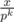

# C. Arpa and a game with Mojtaba

**time limit per test:** 1 second

**memory limit per test:** 256 megabytes

**input:** standard input

**output:** standard output

Mojtaba and Arpa are playing a game. They have a list of *n* numbers in the game.

In a player's turn, he chooses a number *p*^*k*^ (where *p* is a prime number and *k* is a positive integer) such that *p*^*k*^ divides at least one number in the list. For each number in the list divisible by *p*^*k*^, call it *x*, the player will delete *x* and add



 to the list. The player who can not make a valid choice of *p* and *k* loses.

Mojtaba starts the game and the players alternatively make moves. Determine which one of players will be the winner if both players play optimally.

#### Input

The first line contains a single integer *n* (1 ≤ *n* ≤ 100) — the number of elements in the list.

The second line contains *n* integers *a*~1~, *a*~2~, ..., *a*~*n*~ (1 ≤ *a*~*i*~ ≤ 10^9^) — the elements of the list.

#### Output

If Mojtaba wins, print "Mojtaba", otherwise print "Arpa" (without quotes).

You can print each letter in any case (upper or lower).

#### Examples

#### Input
```
4
1 1 1 1
```

#### Output
```
Arpa
```

#### Input
```
4
1 1 17 17
```

#### Output
```
Mojtaba
```

#### Input
```
4
1 1 17 289
```

#### Output
```
Arpa
```

#### Input
```
5
1 2 3 4 5
```

#### Output
```
Arpa
```

#### Note

In the first sample test, Mojtaba can't move.

In the second sample test, Mojtaba chooses *p* = 17 and *k* = 1, then the list changes to [1, 1, 1, 1].

In the third sample test, if Mojtaba chooses *p* = 17 and *k* = 1, then Arpa chooses *p* = 17 and *k* = 1 and wins, if Mojtaba chooses *p* = 17 and *k* = 2, then Arpa chooses *p* = 17 and *k* = 1 and wins.
