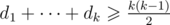
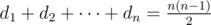

# D. Tournament Construction

**time limit per test:** 2 seconds

**memory limit per test:** 512 megabytes

**input:** standard input

**output:** standard output

Ivan is reading a book about tournaments. He knows that a tournament is an oriented graph with exactly one oriented edge between each pair of vertices. The score of a vertex is the number of edges going outside this vertex.

Yesterday Ivan learned Landau's criterion: there is tournament with scores *d*~1~ ≤ *d*~2~ ≤ ... ≤ *d*~*n*~ if and only if



 for all 1 ≤ *k* < *n* and



.

Now, Ivan wanna solve following problem: given a set of numbers *S* = {*a*~1~, *a*~2~, ..., *a*~*m*~}, is there a tournament with given set of scores? I.e. is there tournament with sequence of scores *d*~1~, *d*~2~, ..., *d*~*n*~ such that if we remove duplicates in scores, we obtain the required set {*a*~1~, *a*~2~, ..., *a*~*m*~}?

Find a tournament with minimum possible number of vertices.

#### Input

The first line contains a single integer *m* (1 ≤ *m* ≤ 31).

The next line contains *m* distinct integers *a*~1~, *a*~2~, ..., *a*~*m*~ (0 ≤ *a*~*i*~ ≤ 30) — elements of the set *S*. It is guaranteed that all elements of the set are distinct.

#### Output

If there are no such tournaments, print string "=(" (without quotes).

Otherwise, print an integer *n* — the number of vertices in the tournament.

Then print *n* lines with *n* characters — matrix of the tournament. The *j*-th element in the *i*-th row should be 1 if the edge between the *i*-th and the *j*-th vertices is oriented towards the *j*-th vertex, and 0 otherwise. The main diagonal should contain only zeros.

#### Examples

#### Input
```
2
1 2
```

#### Output
```
4
0011
1001
0100
0010
```

#### Input
```
2
0 3
```

#### Output
```
6
000111
100011
110001
011001
001101
000000
```
