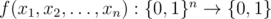

# E. Random Elections

**time limit per test:** 2 seconds

**memory limit per test:** 1024 megabytes

**input:** standard input

**output:** standard output

The presidential election is coming in Bearland next year! Everybody is so excited about this!

So far, there are three candidates, Alice, Bob, and Charlie.

There are *n* citizens in Bearland. The election result will determine the life of all citizens of Bearland for many years. Because of this great responsibility, each of *n* citizens will choose one of six orders of preference between Alice, Bob and Charlie uniformly at random, independently from other voters.

The government of Bearland has devised a function to help determine the outcome of the election given the voters preferences. More specifically, the function is



 (takes *n* boolean numbers and returns a boolean number). The function also obeys the following property: *f*(1 - *x*~1~, 1 - *x*~2~, ..., 1 - *x*~*n*~) = 1 - *f*(*x*~1~, *x*~2~, ..., *x*~*n*~).

Three rounds will be run between each pair of candidates: Alice and Bob, Bob and Charlie, Charlie and Alice. In each round, *x*~*i*~ will be equal to 1, if *i*-th citizen prefers the first candidate to second in this round, and 0 otherwise. After this, *y* = *f*(*x*~1~, *x*~2~, ..., *x*~*n*~) will be calculated. If *y* = 1, the first candidate will be declared as winner in this round. If *y* = 0, the second will be the winner, respectively.

Define the probability that there is a candidate who won two rounds as *p*. *p*·6^*n*^ is always an integer. Print the value of this integer modulo 10^9^ + 7 = 1 000 000 007.

#### Input

The first line contains one integer *n* (1 ≤ *n* ≤ 20).

The next line contains a string of length 2^*n*^ of zeros and ones, representing function *f*. Let *b*~*k*~(*x*) the *k*-th bit in binary representation of *x*, *i*-th (0-based) digit of this string shows the return value of *f*(*b*~1~(*i*), *b*~2~(*i*), ..., *b*~*n*~(*i*)).

It is guaranteed that *f*(1 - *x*~1~, 1 - *x*~2~, ..., 1 - *x*~*n*~) = 1 - *f*(*x*~1~, *x*~2~, ..., *x*~*n*~) for any values of *x*~1~, *x*~2~, *ldots*, *x*~*n*~.

#### Output

Output one integer — answer to the problem.

#### Examples

#### Input
```
3
01010101
```

#### Output
```
216
```

#### Input
```
3
01101001
```

#### Output
```
168
```

#### Note

In first sample, result is always fully determined by the first voter. In other words, *f*(*x*~1~, *x*~2~, *x*~3~) = *x*~1~. Thus, any no matter what happens, there will be a candidate who won two rounds (more specifically, the candidate who is at the top of voter 1's preference list), so *p* = 1, and we print 1·6^3^ = 216.
