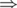

# A. Arpa and a research in Mexican wave

**time limit per test:** 1 second

**memory limit per test:** 256 megabytes

**input:** standard input

**output:** standard output

Arpa is researching the Mexican wave.

There are *n* spectators in the stadium, labeled from 1 to *n*. They start the Mexican wave at time 0.

- At time 1, the first spectator stands.
- At time 2, the second spectator stands.
- ...
- At time *k*, the *k*-th spectator stands.
- At time *k* + 1, the (*k* + 1)-th spectator stands and the first spectator sits.
- At time *k* + 2, the (*k* + 2)-th spectator stands and the second spectator sits.
- ...
- At time *n*, the *n*-th spectator stands and the (*n* - *k*)-th spectator sits.
- At time *n* + 1, the (*n* + 1 - *k*)-th spectator sits.
- ...
- At time *n* + *k*, the *n*-th spectator sits.

Arpa wants to know how many spectators are standing at time *t*.

#### Input

The first line contains three integers *n*, *k*, *t* (1 ≤ *n* ≤ 10^9^, 1 ≤ *k* ≤ *n*, 1 ≤ *t* < *n* + *k*).

#### Output

Print single integer: how many spectators are standing at time *t*.

#### Examples

#### Input
```
10 5 3
```

#### Output
```
3
```

#### Input
```
10 5 7
```

#### Output
```
5
```

#### Input
```
10 5 12
```

#### Output
```
3
```

#### Note

In the following a sitting spectator is represented as -, a standing spectator is represented as ^.

- At *t* = 0  ----------


 number of standing spectators = 0.
- At *t* = 1  ^---------


 number of standing spectators = 1.
- At *t* = 2  ^^--------


 number of standing spectators = 2.
- At *t* = 3  ^^^-------


 number of standing spectators = 3.
- At *t* = 4  ^^^^------


 number of standing spectators = 4.
- At *t* = 5  ^^^^^-----



 number of standing spectators = 5.
- At *t* = 6  -^^^^^----


 number of standing spectators = 5.
- At *t* = 7  --^^^^^---


 number of standing spectators = 5.
- At *t* = 8  ---^^^^^--


 number of standing spectators = 5.
- At *t* = 9  ----^^^^^-


 number of standing spectators = 5.
- At *t* = 10 -----^^^^^


 number of standing spectators = 5.
- At *t* = 11 ------^^^^


 number of standing spectators = 4.
- At *t* = 12 -------^^^


 number of standing spectators = 3.
- At *t* = 13 --------^^


 number of standing spectators = 2.
- At *t* = 14 ---------^


 number of standing spectators = 1.
- At *t* = 15 ----------


 number of standing spectators = 0.
