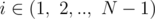
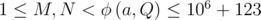
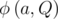
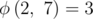

# F. Product transformation

**time limit per test:** 3 seconds

**memory limit per test:** 256 megabytes

**input:** standard input

**output:** standard output

Consider an array *A* with *N* elements, all being the same integer *a*.

Define the product transformation as a simultaneous update *A*~*i*~ = *A*~*i*~·*A*~*i* + 1~, that is multiplying each element to the element right to it for



, with the last number *A*~*N*~ remaining the same. For example, if we start with an array *A* with *a* = 2 and *N* = 4, then after one product transformation *A* = [4,  4,  4,  2], and after two product transformations *A* = [16,  16,  8,  2].

Your simple task is to calculate the array *A* after *M* product transformations. Since the numbers can get quite big you should output them modulo *Q*.

#### Input

The first and only line of input contains four integers *N*, *M*, *a*, *Q* (7 ≤ *Q* ≤ 10^9^ + 123, 2 ≤ *a* ≤ 10^6^ + 123,



,


 is prime), where


 is the multiplicative order of the integer *a* modulo *Q*, see notes for definition.

#### Output

You should output the array *A* from left to right.

#### Example

#### Input
```
2 2 2 7
```

#### Output
```
1 2 
```

#### Note

The multiplicative order of a number *a* modulo *Q*



, is the smallest natural number *x* such that *a*^*x*^ *mod* *Q* = 1. For example,



.
