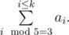
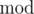

# D. Sum of Medians

**time limit per test:** 3 seconds

**memory limit per test:** 256 megabytes

**input:** stdin

**output:** stdout

In one well-known algorithm of finding the *k*-th order statistics we should divide all elements into groups of five consecutive elements and find the median of each five. A median is called the middle element of a sorted array (it's the third largest element for a group of five). To increase the algorithm's performance speed on a modern video card, you should be able to find a sum of medians in each five of the array.

A sum of medians of a sorted *k*-element set *S* = {*a*~1~, *a*~2~, ..., *a*~*k*~}, where *a*~1~ < *a*~2~ < *a*~3~ < ... < *a*~*k*~, will be understood by as



The



 operator stands for taking the remainder, that is


 stands for the remainder of dividing *x* by *y*.

To organize exercise testing quickly calculating the sum of medians for a changing set was needed.

#### Input

The first line contains number *n* (1 ≤ *n* ≤ 10^5^), the number of operations performed.

Then each of *n* lines contains the description of one of the three operations:

- add *x* — add the element *x* to the set;
- del *x* — delete the element *x* from the set;
- sum — find the sum of medians of the set.

For any add *x* operation it is true that the element *x* is not included in the set directly before the operation.

For any del *x* operation it is true that the element *x* is included in the set directly before the operation.

All the numbers in the input are positive integers, not exceeding 10^9^.

#### Output

For each operation sum print on the single line the sum of medians of the current set. If the set is empty, print 0.

Please, do not use the %lld specificator to read or write 64-bit integers in C++. It is preferred to use the cin, cout streams (also you may use the %I64d specificator).

#### Examples

#### Input
```
6
add 4
add 5
add 1
add 2
add 3
sum
```

#### Output
```
3
```

#### Input
```
14
add 1
add 7
add 2
add 5
sum
add 6
add 8
add 9
add 3
add 4
add 10
sum
del 1
sum
```

#### Output
```
5
11
13
```
